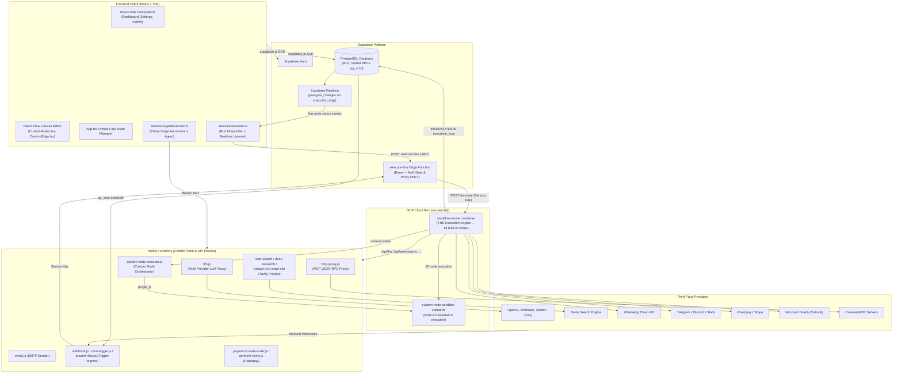
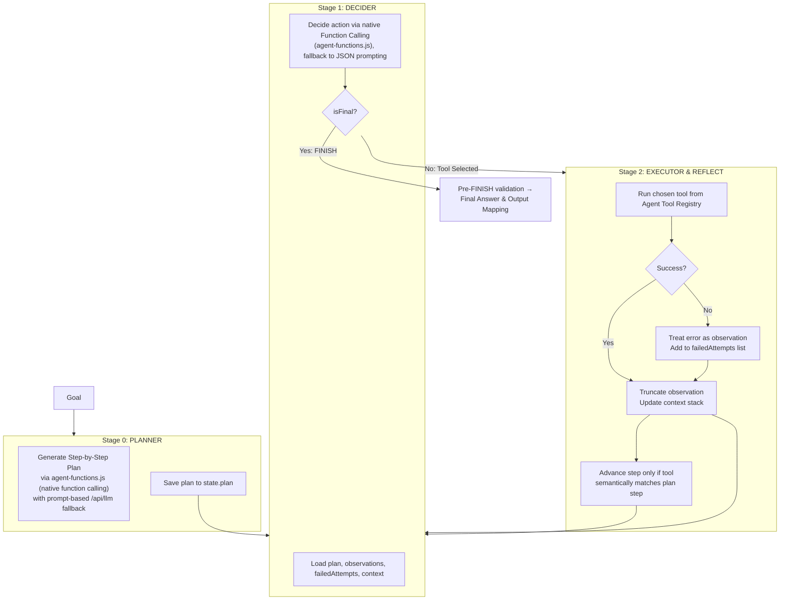

# Blupe (BLOOPE) - Platform Architecture & System Engineering Manual

This document provides a comprehensive, production-grade explanation of the **Blupe (BLOOPE) No-Code AI Workflow Orchestration Platform**. It details the structural design, data schemas, execution runtimes, security boundaries, and performance engineering principles of the system.

---

## 1. High-Level System Architecture

Blupe uses a **Unified Server-Side Execution Engine**. All workflow runs — whether triggered interactively from the canvas, by inbound webhooks, by schedules, or by public form submissions — execute on a single Node.js runner deployed to GCP Cloud Run. The browser no longer executes nodes; it dispatches runs and paints live progress streamed back through Supabase Realtime.

### Component Relationship Map



---

## 2. Execution Architecture

### 2.1 The Unified Runtime Model

Earlier iterations of the platform ran three parallel executors (browser, Deno edge, Cloud Run) with duplicated node logic. The current architecture consolidates all node execution into **one runtime**: the Cloud Run `workflow-runner`. The other layers have narrower roles:

| Layer | File | Role |
|---|---|---|
| Browser dispatcher | `services/executor.ts` | Sanitizes the graph, dispatches the run, streams live status via Realtime, handles HITL approval popups |
| Deno edge proxy | `supabase/functions/execute-flow/index.ts` | Authentication gate + request forwarder. **Executes no nodes.** |
| Cloud Run runner | `cloudrun/workflow-runner/server.js` | Executes every node, writes logs, meters credits, persists history |
| Cloud Run sandbox | `cloudrun/custom-node-sandbox/server.js` | Isolated `node:vm` execution of user JavaScript |
| Netlify functions | `netlify/functions/*` | API proxies (LLM, Tavily, MCP, email), trigger ingress, OAuth, billing |

The browser-resident **Agent node** (`services/agentExecutor.ts`) is the one exception that still executes client-side; it drives its ReAct loop from the browser and calls Netlify `/api/*` proxies directly.

### 2.2 Canvas Run Lifecycle (`services/executor.ts`)

An interactive "Run" from the editor proceeds as follows:

1. **Sanitize**: Visual properties (`position`, `width`, `height`, `selected`, `dragging`) and any embedded secret fields (`apiKey`, `password`, `accessToken`, ...) are stripped from nodes before they leave the browser.
2. **Optimistic paint**: All nodes reset to `IDLE`; trigger nodes (no incoming edges) are optimistically set to `RUNNING` for instant visual feedback.
3. **Realtime subscribe**: The client opens a Supabase Realtime channel on `execution_logs` filtered by `run_id=eq.<runId>` (the client generates `runId` up front). INSERTs with `status='running'` paint a node as running; UPDATEs to `success`/`error` paint terminal states and append to the log viewer. Subscription is intentionally **not awaited** — starting a run never blocks on the Realtime handshake.
4. **Dispatch**: The client POSTs `{type: 'direct', flowId, nodes, edges, payload, runId, mode: 'production'}` to the Supabase edge function with the user's JWT and `x-flow-id` header.
5. **Race for completion**: The client races the HTTP response against a special `__run_end__` marker row arriving over Realtime. Whichever lands first releases the Run button — so a delayed proxy response never leaves the UI spinning after the work is actually done.
6. **Fallback reconciliation**: If Realtime dropped events, the HTTP response's `logs` array back-fills any node statuses that were missed.
7. **HITL approvals**: If the response reports `status: 'paused'` with a `resumeToken`, a local approval popup opens. It races against *external* resolution (an approve/reject link clicked in Telegram/Slack/email): any Realtime event arriving mid-popup means someone resumed the flow elsewhere, so the popup dismisses and the client waits for `__run_end__` instead.

### 2.3 The Edge Proxy (`supabase/functions/execute-flow/index.ts`)

A deliberately thin Deno function that performs **authentication and routing only**:

- **Service callers** (Netlify webhook/cron/resume functions passing the service-role key as bearer): trusted; `userId` accepted from the body.
- **Logged-in users** (JWT bearer): validated via `supabase.auth.getUser()`; the token's user becomes the billed user.
- **Guest public runs** (`x-flow-id` header, no auth): allowed only if the target flow has `is_published = true`; billed to the flow owner.

It then forwards the request to the Cloud Run runner — `/execute` for new runs, `/resume` for HITL continuations — authenticated with the `SUPABASE_SERVICE_ROLE_KEY`, and relays the runner's JSON response back to the caller. The runner's base URL comes from the `CLOUD_RUN_WORKFLOW_RUNNER_URL` edge environment variable.

### 2.4 The Cloud Run Workflow Runner (`cloudrun/workflow-runner/server.js`)

A Node.js 22 + Express application; the single source of truth for node semantics.

**Endpoints** (all guarded by a service-key bearer check):
- `POST /execute` — handles `type: 'direct'` (canvas + public runs), `type: 'scheduled'` (cron), `type: 'webhook'` (drains the webhook queue), and queue fallback.
- `POST /resume` — validates a HITL resume token, restores the context snapshot, and continues execution from the paused node's outgoing edges.
- `GET /health` — Cloud Run liveness probe.

**Execution loop** (`executeWorkflow`):
1. Fetch and decrypt the owner's `user_secrets` (AES-256-GCM envelope encryption keyed by `SECRETS_MASTER_KEY`; ciphertexts are `enc:iv:data:authTag`). A decryption failure aborts the run rather than executing with corrupt credentials.
2. Seed the queue with explicit `startNodeIds` (resume case) or all trigger/parentless nodes.
3. BFS loop: shift a node, skip if already processed, then:
   - **INSERT a `running` row** into `execution_logs` so the canvas paints live progress via Realtime.
   - Execute the node (see catalog below). Node types on the retryable list (`llm`, `api_call`, `web_search`, `email`, messaging sends, connectors, ...) are wrapped in `withRetry` — up to 3 attempts with exponential backoff (1s → 2s → 4s).
   - Store output into context under both `context[nodeId]` and `context[variableName]`.
   - **UPDATE the same log row** to its terminal `success`/`error` status with output, duration, and credits.
   - On error: halt the run. On `paused` (approval node): snapshot the entire context into `paused_executions`, dispatch the approval notification, and halt.
   - Route to downstream nodes. `condition`/`router` nodes return `activeHandles`; only edges whose `sourceHandle` matches are followed (with a `default` handle fallback).
4. **Billing**: `mode: 'production'` deducts `base_fee (10) + Σ node costs` via the `deduct_credits` RPC. `mode: 'preview'` skips deduction and enforces a 60-second wall-clock cap.
5. **Run-end marker**: a synthetic `execution_logs` row with `node_id='__run_end__'` carrying final status and credits — the authoritative "run finished" signal for the canvas.
6. **History**: the full log array persists to `run_history` keyed by `runId`.

**Variable interpolation** (`interpolateVariables` + `resolvePrimaryString`): `{{variable}}` templates resolve against the context with dot-notation support (`{{nodeId.field.sub}}`) and `{{env.KEY}}` for secrets. When a reference resolves to a structured object, `resolvePrimaryString` extracts the primary text field (`answer` → `text` → `summary` → `content`) before falling back to `JSON.stringify` — so piping an LLM/reasoning node's output into a message body produces clean prose instead of raw JSON. The same function is mirrored in `custom-node-executor.js` for cross-runtime parity.

**Built-in node catalog** (executed natively in the runner):

| Category | Node Types | Mechanics |
|---|---|---|
| Triggers | `start`, `webhook`, `schedule`, `form_trigger`, `telegram_trigger`, `whatsapp_trigger`, `razorpay_trigger`, `discord_trigger` | Pass initial context through |
| AI | `llm`/`gemini`, `ai_vision`, `reasoning`, `batch` | Proxied through Netlify `/api/llm` with per-user BYOK keys; reasoning wraps a structured `<thinking>/<answer>` protocol |
| Research | `web_search`, `deep_research`, `extract_url`, `crawl_site` | Proxied through Netlify Tavily functions |
| Logic | `condition`, `router`, `math`, `text`, `json`, `input`, `output`, `wait` | Evaluated in-process; math/conditions use the `mathjs` AST evaluator (no `eval`) |
| Code | `javascript` | **Always** dispatched to the Cloud Run sandbox (`CLOUD_RUN_CUSTOM_NODE_URL`) with capability-filtered secrets; local execution is refused if no sandbox is configured |
| Messaging | `email` (Microsoft Graph or SMTP via `/api/email`), `telegram_send`, `discord_send` (webhook or bot), `whatsapp_send` (text/template/media), `slack` | Direct provider API calls; OAuth tokens fall back to the `oauth_connections` table when not in secrets |
| Connectors | `api_call`, `rss`, `sheets`, `hubspot`, `stripe`, `razorpay_action`, `zapier_webhook`, `mcp` | Direct API calls; MCP calls route through `/api/mcp-proxy` with schema-validated, type-coerced arguments |
| Control | `approval` | Pauses the run; generates a resume token; notifies via Telegram/Discord/Slack/webhook |
| Custom | anything not in `BUILT_IN_NODE_TYPES` | Forwarded to Netlify `/api/custom-node-executor` |

### 2.5 Trigger Ingress Paths

All non-canvas triggers converge on the same edge proxy → runner path, authenticated with the service key:

- **Webhooks** (`netlify/functions/webhook.js`): validates the flow's webhook API key (timing-safe compare), enforces the rate-limit RPC, inserts into `webhook_queue`, then either fires `execute-flow` async (respond-immediately mode) or awaits the result (respond-with-output mode).
- **Schedules** (`netlify/functions/cron-trigger.js`): invoked by `pg_cron` per `flow_schedules`; fires `execute-flow` with `type: 'scheduled'`. The runner reports back via the `update_schedule_run` RPC.
- **HITL resume links** (`netlify/functions/resume-flow.js`): renders the approve/reject confirmation page and forwards the decision as `type: 'resume'`.
- **Messaging platform webhooks** (`telegram-webhook.js`, `whatsapp-webhook.js`, `discord-webhook.js`, `razorpay-webhook.js`): normalize provider payloads and dispatch matching trigger flows.

### 2.6 Human-in-the-Loop (HITL) Approval Flow

1. The `approval` node returns `paused: true` with a fresh `resumeToken` (UUID).
2. The runner snapshots the full variable context into `paused_executions` and sends the notification — Telegram bot message, Discord/Slack webhook, or a signed generic webhook (`X-Bloope-Signature: sha256=HMAC(timestamp.body)`), each carrying approve/reject URLs.
3. Resume tokens are single-use and expire after **7 days**; expired tokens flip the row to `expired`.
4. On resume, the runner marks the row `resumed`, injects `{approved, action}` into the context under the approval node's ID/variable name, and re-enters `executeWorkflow` starting from the paused node's outgoing edge targets — reusing the original `runId` so Realtime and history stay contiguous.
5. A canvas that is still open during an external resume detects the incoming Realtime activity, dismisses its local popup, and waits for `__run_end__`.

### 2.7 MCP (Model Context Protocol) Proxy (`netlify/functions/mcp-proxy.js`)

- Handles MCP JSON-RPC between executors (runner, browser agent) and external MCP servers.
- **SSE transport**: opens an SSE GET channel, waits for the `endpoint` event to discover the message POST URL, forwards the request, and correlates streamed responses by JSON-RPC ID.
- **Direct POST fallback** for non-SSE JSON-RPC endpoints.
- **SSRF protection**: DNS-resolving host validation blocks loopback, private subnets, and the GCP metadata server before any outbound request.

---

## 3. Database System Architecture (Supabase / PostgreSQL)

```mermaid
erDiagram
    user_credits {
        uuid user_id PK
        numeric balance
        varchar tier
        integer flow_limit
        boolean is_admin
        timestamptz subscription_end_date
        timestamptz last_reset_date
    }
    flows {
        uuid id PK
        uuid user_id FK
        varchar name
        jsonb content
        boolean is_published
        boolean webhook_enabled
        varchar webhook_api_key
        varchar webhook_response_mode
    }
    execution_logs {
        uuid id PK
        uuid run_id
        uuid flow_id FK
        varchar node_id
        varchar node_type
        varchar status
        jsonb input
        jsonb output
        text error
        integer duration_ms
        numeric credits_used
        uuid user_id
    }
    run_history {
        uuid id PK
        uuid flow_id FK
        uuid user_id FK
        varchar status
        integer duration
        numeric credits_used
        jsonb logs
        varchar triggered_by
    }
    user_secrets {
        uuid user_id PK_FK
        varchar key_name PK
        text value
    }
    oauth_connections {
        uuid user_id FK
        varchar provider
        text access_token
        text refresh_token
    }
    paused_executions {
        uuid id PK
        uuid run_id
        uuid flow_id FK
        varchar node_id
        uuid resume_token
        jsonb context_snapshot
        varchar status
        timestamptz resumed_at
    }
    webhook_queue {
        uuid id PK
        uuid flow_id FK
        jsonb payload
        varchar status
        timestamptz processed_at
    }
    flow_schedules {
        uuid flow_id PK_FK
        uuid user_id FK
        varchar cron_expression
        varchar cron_job_id
        boolean is_active
        timestamptz last_run_at
    }

    user_credits ||--o{ flows : owns
    flows ||--o{ execution_logs : streams
    flows ||--o{ run_history : runs
    flows ||--o{ paused_executions : pauses
    flows ||--o{ webhook_queue : queues
    flows ||--o{ flow_schedules : schedules
    user_credits ||--o{ user_secrets : stores
    user_credits ||--o{ oauth_connections : connects
```

### 3.1 Table Schema Catalog

- **`user_credits`**: Core profile mapping users to balances and limits; balances cannot go negative (DB constraint).
- **`flows`**: Graph configurations. `content` JSONB stores React Flow arrays (`content.nodes`, `content.edges`, and `versions` snapshots for flow history). `is_published` gates guest public runs.
- **`execution_logs`**: The live progress stream. The runner INSERTs a `running` row per node and UPDATEs it to terminal status; Supabase Realtime broadcasts both events to the canvas. Contains the `__run_end__` marker convention. `user_id` is foreign-keyed to `auth.users(id)` and RLS policies are enabled to restrict Realtime read access to the flow owner only.
- **`run_history`**: One row per run (`id = runId`) with the complete embedded log array, duration, credits, and trigger source (`Manual`, `Webhook`, `Schedule`, `Public Runner`, `Resume`).
- **`user_secrets`**: Envelope-encrypted key-value credential store.
- **`oauth_connections`**: Provider OAuth tokens (Microsoft, WhatsApp, Google, Slack, HubSpot, Stripe); the runner falls back to these when a matching secret key is absent.
- **`paused_executions`**: HITL state snapshots — variable stack, paused node pointer, resume token, lifecycle status (`paused` → `resumed`/`expired`).
- **`webhook_queue`**: Async ingress buffer so inbound webhooks never block on execution.
- **`flow_schedules`**: Binds `pg_cron` jobs to flows.

### 3.2 Stored Procedures & RPC APIs

- **`deduct_credits(uid, amount)`**: Atomically decrements the credit wallet; raises on insufficient balance.
- **`check_webhook_rate_limit(p_flow_id, p_client_ip, p_limit, p_window_hours)`**: Enforces the 100 req/hour webhook bucket.
- **`upsert_flow_schedule(p_flow_id, p_cron_expression, p_is_active)`**: Registers/updates the `cron.schedule` job that fires `cron-trigger`.
- **`update_schedule_run(p_flow_id, p_success, p_error)`**: Records schedule outcomes back onto `flow_schedules`.
- **`get_pending_webhooks(limit_count)`**: Dequeues pending webhook work for the runner's queue-drain mode.

---

## 4. Autonomous Agent Architecture (ReAct Loop)

The Agent Node (`NodeType.AGENT`) implements a **Three-Stage ReAct (Reasoning and Action) Loop**. Unlike regular nodes, the agent loop currently runs **client-side** (`services/agentExecutor.ts`), calling Netlify `/api/*` proxies with the user's JWT.

### 4.1 The Three-Stage Agent Loop



### 4.2 Key Loop Guardrails

1. **Step-gated progression**: `currentStep` advances only when the executed tool semantically matches the current plan step (tool-name match, keyword-intent match, or MCP tool success).
2. **Premature-FINISH blocking**: FINISH is rejected while plan steps remain, and — for goals implying a deliverable (email/report) — until a primary artifact is declared and exceeds a minimum content length.
3. **Idempotency & duplicate suppression**: Failed tool+input combos are never retried identically; successful side-effect tools (`send_email`, `send_slack`) are blocked from exact duplicates; expensive tools (`deep_research`, `crawl_site`) won't re-run on identical inputs.
4. **Loop detection**: Three consecutive invalid tool selections or three identical searches abort the run.
5. **Observation truncation**: Tool outputs are capped (300–3000 chars depending on context) to prevent context-window inflation.
6. **Artifact registry**: `synthesize_report` validates report JSON against a schema (with automatic JSON repair and retry), stores it in a durable artifact store, and returns a handle (`art_...`); delivery tools (`send_email`) render deterministically from the stored artifact — the LLM never writes the email body directly.
7. **Primacy bias remediation**: Tools are prompt-ordered from most specific (`deep_research`) to most generic (`llm_call`, `calculate`).
8. **Dynamic MCP tools**: Tools discovered on user-configured MCP servers are merged into the registry at runtime (`buildMcpAgentTools`) and executed through the MCP proxy.

### 4.3 Agent Node Costs & Arbitrage

- **Plan Generation**: 4 credits (once).
- **Decision Step**: 6 credits (per iteration).
- **Tool Execution**: Flat 5 credits (regardless of standalone tool cost).

> [!TIP]
> **Wholesale Agent Pricing**: Executing `deep_research` inside an Agent node costs only 5 credits (flat tool fee) instead of the 35 credits billed when running `deep_research` as a standalone node on the canvas.

---

## 5. Custom Nodes & JavaScript Sandboxing

### 5.1 Custom Node Orchestrator (`netlify/functions/custom-node-executor.js`)

Nodes whose type is not in the runner's `BUILT_IN_NODE_TYPES` set are forwarded to this Netlify function, which resolves the node's admin-defined execution recipe and dispatches by `customExecutionType`:

- **`api_call`** — templated HTTP request with interpolated config.
- **`javascript`** / **`plugin_js`** — user code shipped to the Cloud Run sandbox.
- **`llm_prompt`** — templated prompt through the LLM proxy.

The function re-validates the node's code/config against the stored definition in the database — a tampered client-side copy is replaced by the canonical stored version before execution.

### 5.2 The Container Boundary Security Model

Security assumes a `node:vm` escape is possible and hardens the container boundary instead:

- **No ambient credentials**: The sandbox container holds no database endpoints or platform keys; secrets arrive strictly per-request from the orchestrator payload.
- **VPC egress lockdown**: A VPC connector blocks the GCP metadata server (`169.254.169.254`) and internal subnets.
- **Ephemeral, single-tenant execution**: Low concurrency (4), 30s hard timeout, min-instances 0.
- **Least-privilege secret filtering** (`filterSecretsForSandbox`): Only secrets matching requested capabilities (`llm` → provider keys, `sarvam` → Sarvam keys) or statically referenced in the code (`secrets.KEY` / `secrets['KEY']`) are transmitted. A shared-secret header (`X-Blupe-Custom-Node-Secret`) authenticates callers.

### 5.3 Sandbox Runtime (`cloudrun/custom-node-sandbox/`)

- **Engine**: Node's native `node:vm` contexts.
- **Preloaded packages**: `lodash`, `dayjs`, `cheerio`, `csv-parse`, `csv-stringify`, `uuid`, `validator`, `adm-zip`.
- **Helper scope**: `helpers.http` (get/post/put/delete with JSON parsing), `helpers.crypto` (SHA-256, UUID), `helpers.log` (captured console output returned to the caller), `helpers.sarvam` (translation, TTS, STT, chat, document digitization).
- **Request schema**: `{code, timeoutMs (100–30,000ms), capabilities[], context, secrets, config, llmEndpoint, llmDefaults}`.
- **Async wrapper**: User code is wrapped in an async closure so top-level `await` works naturally.

---

## 6. Credit & Billing Mechanics

### 6.1 Pricing Tiers

| Tier | Monthly Fee | Included Credits | Flow Limit | Version History | Execution Retain |
|---|---|---|---|---|---|
| **Starter** | Free | 100 credits | 3 active flows | 3 snapshots | 3 days history |
| **Pro** | ₹1799 | 5000 credits | 50 active flows | 10 snapshots | 30 days history |
| **Enterprise** | Custom | Configurable | Unlimited | Infinite | Custom |

### 6.2 Server-Side Run Costs (runner `CREDIT_COSTS`)

Every production run pays a **base fee of 10 credits**, plus per-node costs:

| Node Type | Cost (Credits) |
|---|---|
| Triggers (`start`, `webhook`, `schedule`, `form_trigger`, ...) | 0 |
| Logic (`javascript`, `condition`, `router`, `math`, `text`, `json`, `batch`) | 1 |
| Connectors (`api_call`, `rss`, `sheets`, `hubspot`, `stripe`, `zapier_webhook`) | 2 |
| MCP tool call | 2 |
| `telegram_send`, `discord_send`, `web_search` | 3 |
| `email`, `whatsapp_send`, `razorpay_action` | 5 |
| LLM (`llm`/`gemini`, default) | 10 |
| `extract_url` | 10 |
| `ai_vision` | 15 |
| Reasoning (platform keys) | 20 (BYOK: 3) |
| `crawl_site` | 25 |
| `deep_research` | 35 |

`mode: 'preview'` runs calculate but do not deduct credits, and are capped at 60 seconds.

### 6.3 Payment Integration

Razorpay handles subscriptions: `payment-create-order.js` creates orders, `payment-verify.js` verifies the `razorpay_signature` HMAC before crediting, and `razorpay-webhook.js` processes asynchronous events with idempotency locks (database unique constraints).

---

## 7. Security & Privacy Controls

1. **Layered authentication**: The edge proxy accepts exactly three caller classes (service key, user JWT, published-flow guest); the Cloud Run runner and sandbox each independently verify their own shared-secret bearer before doing any work — a leaked runner URL alone is useless.
2. **Secrets at rest**: `user_secrets` values use AES-256-GCM envelope encryption keyed by `SECRETS_MASTER_KEY` (SHA-256-derived). The runner refuses to boot decryption with a missing or known-default master key, and aborts runs on decryption failure.
3. **Secrets in transit**: The browser strips secret-bearing fields from node data before dispatch; the runner injects secrets server-side at interpolation time.
4. **Webhook timing safety**: Inbound webhook keys are compared with `crypto.timingSafeEqual`.
5. **No dynamic evaluation in the runner**: `math` and `condition` nodes use the `mathjs` AST parser; the `javascript` node refuses to run without a configured sandbox — there is no local `eval`/`new Function` fallback path.
6. **Sandbox least privilege**: Static code analysis transmits only referenced/capability-required secrets; the container has zero ambient credentials and locked-down egress.
7. **MCP SSRF protection**: DNS-resolved host validation blocklists loopback, private ranges, and cloud metadata endpoints, defeating DNS-rebinding.
8. **HITL token hygiene**: Resume tokens are single-use UUIDs with a 7-day validity window and signed webhook notifications (`X-Bloope-Signature` HMAC with timestamp binding).
9. **RLS-scoped Realtime**: `execution_logs.user_id` lets Row-Level Security grant only the flow owner live read access to their run stream.

---

## 8. Performance & Scaling Engineering

### 8.1 Deployment Topology

| Service | Platform | Region | Scaling | Timeout |
|---|---|---|---|---|
| `blupe-workflow-runner` | Cloud Run | us-central1 | min 1 / max 4 instances, concurrency 80 | 900s |
| `blupe-custom-node-sandbox` | Cloud Run | us-central1 | min 0 / max 4 instances, concurrency 4 | 30s |
| `execute-flow` | Supabase Edge (Deno) | Supabase project region | autoscaled | platform-managed |
| Netlify functions | Netlify | provider-managed | autoscaled | 10–26s |

`min-instances 1` on the runner eliminates cold starts on the critical execution path. The sandbox tolerates cold starts (short, bursty workloads; strict 30s ceiling).

### 8.2 Latency Engineering in the Run Path

- **Non-blocking Realtime**: The canvas subscribes before dispatch but never awaits the handshake; the HTTP response back-fills missed events.
- **Optimistic UI**: Trigger nodes paint as `running` the instant the user clicks Run, masking dispatch latency.
- **`__run_end__` race**: The UI unblocks on whichever arrives first — the Realtime end marker or the HTTP response — so proxy/network tail latency never delays perceived completion.
- **Retry with backoff**: Transient provider failures on network-bound nodes retry up to 3× (1s/2s/4s) instead of failing the whole run.

### 8.3 Known Bottlenecks & Optimization Roadmap

The unified server-side architecture trades the old client-runtime's zero-hop latency for consistency, security, and headless triggers. Current known costs, in priority order for optimization:

1. **Proxy hop for AI/search nodes**: The runner calls Netlify (`/api/llm`, Tavily proxies) instead of providers directly — one extra network hop (plus possible Netlify cold start) per AI node. *Planned: inline provider dispatch in the runner.*
2. **Two blocking log writes per node**: The `running` INSERT and terminal UPDATE are awaited inline. *Planned: fire-and-forget writes with an end-of-run flush.*
3. **Edge proxy auth round-trip**: `auth.getUser()` is a network call per canvas run. *Planned: local JWT verification (JWKS) in the proxy or direct-to-runner dispatch.*
4. **Per-run setup queries**: Secrets fetch, flow fetch (redundant when the canvas already sent nodes/edges), and Supabase client construction happen serially per request. *Planned: module-level client reuse, parallelized setup, short-TTL secrets cache.*
5. **Region alignment**: Runner region (us-central1) should match the Supabase project region to keep per-node log writes single-digit-millisecond.
6. **Sequential branch execution**: The BFS loop runs parallel branches serially. *Planned: in-degree-based concurrent dispatch.*
