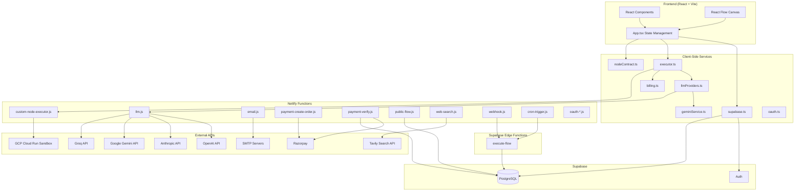
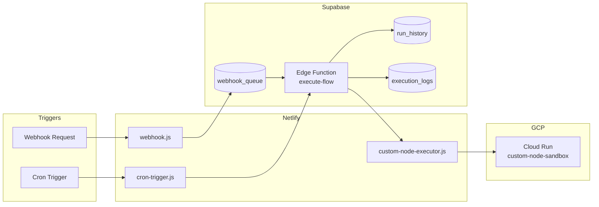
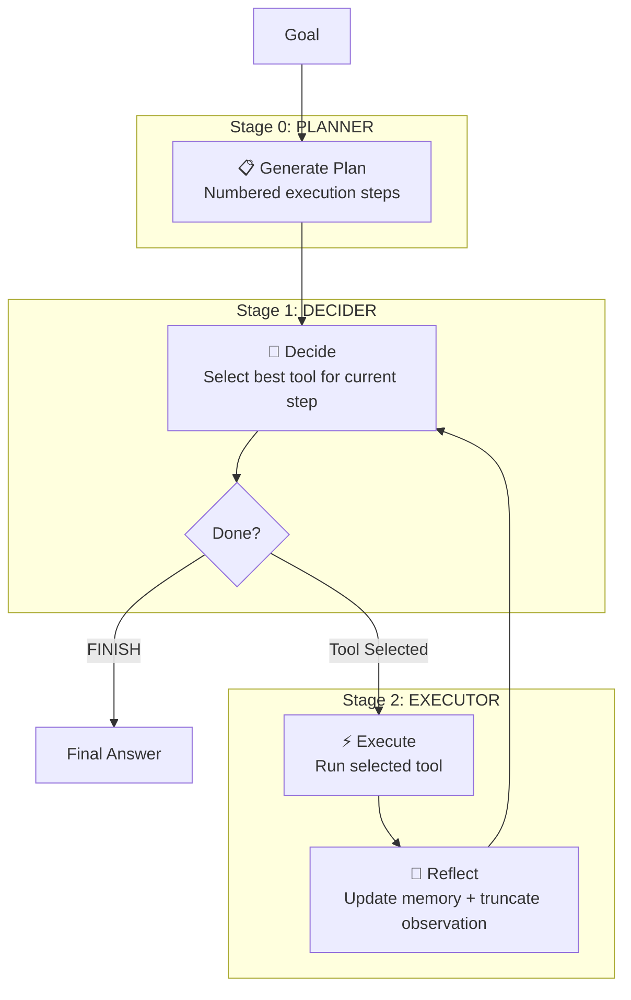
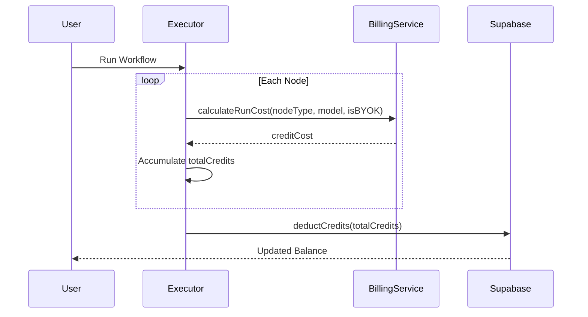
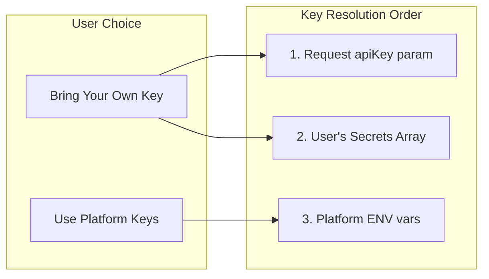

# BLOOPE (Blupe) - Development Documentation

> **Version:** 2.0.0  
> **Last Updated:** April 2026  
> **Project Type:** No-Code AI Workflow Orchestration Platform

---

## Table of Contents

1. [Architecture Overview](#architecture-overview)
2. [Technology Stack](#technology-stack)
3. [Service Layer](#service-layer)
4. [Netlify Serverless Functions](#netlify-serverless-functions)
5. [Node Types & Workflow Engine](#node-types--workflow-engine)
6. [Server-Side Execution](#server-side-execution)
7. [Credit & Billing System](#credit--billing-system)
8. [Authentication & Database](#authentication--database)
9. [API Key Management (BYOK)](#api-key-management-byok)
10. [OAuth Integrations](#oauth-integrations)
11. [Security Architecture](#security-architecture)
12. [Admin Console](#admin-console)
13. [Design Decisions & Rationale](#design-decisions--rationale)
14. [Known Limitations](#known-limitations)
15. [Environment Variables](#environment-variables)
16. [Running the Project](#running-the-project)
17. [Webhooks Guide](#webhooks-guide)

---

## Architecture Overview

> [!NOTE]
> For a comprehensive, production-grade architectural blueprint including execution lifecycles, database schemas, security boundaries, and ReAct agent patterns, please refer to the dedicated [Architecture.md](file:///Users/aravind/Desktop/Project/BLOOPE/Architecture.md).




---

## Node Compatibility Contract

The current node system is intentionally split into two runtime classes:

- **Built-in nodes** are the hardcoded `NodeType` enum members. They keep their existing renderer, property-panel, billing, and execution behavior.
- **Custom nodes** are admin-defined nodes that preserve their business identity in `data.type` and render through React Flow `type: "default"`.

### Canonical rules

- Resolve business identity with `getEffectiveNodeType(node)`, which uses `node.data?.type ?? node.type`.
- Normalize imported/loaded/generated flows with `normalizeFlowNodes(nodes)` before storing them in UI state.
- Built-in nodes preserve their current React Flow `type`.
- Custom nodes normalize to React Flow `type: "default"` and carry a persisted execution snapshot on `NodeData`.

### Custom node snapshot

Custom nodes persist the following fields directly on the node so saved flows continue to work even if the admin definition changes later:

- `customDefinitionId`
- `customDefinitionUpdatedAt`
- `customDisplayName`
- `customDescription`
- `customIcon`
- `customColor`
- `customExecutionType`
- `customExecutionConfig`
- `customCreditCost`
- `customConfigSchema`

### Why this exists

This compatibility layer fixes the previous mismatch where some code keyed off `node.type` while custom nodes stored their real identity only in `data.type`. It also ensures that built-in nodes such as `sheets`, `ai_vision`, `mcp`, `hubspot`, `stripe`, `agent`, `reasoning`, `web_search`, `deep_research`, `extract_url`, and `crawl_site` keep their existing behavior unchanged.

---

## Technology Stack

| Layer | Technology | Version | Purpose |
|-------|------------|---------|---------|
| **Frontend** | React | 19.2.1 | UI Framework |
| **Build Tool** | Vite | 6.2.0 | Fast development & bundling |
| **Canvas** | React Flow | 11.11.4 | Node-based workflow editor |
| **Icons** | Lucide React | 0.556.0 | UI iconography |
| **Styling** | Vanilla CSS | - | Custom styling |
| **Routing** | React Router DOM | 7.10.1 | Client-side routing |
| **Auth/DB** | Supabase | 2.39.3 | Authentication & PostgreSQL |
| **Serverless** | Netlify Functions | - | Backend API endpoints |
| **Edge Functions** | Supabase Deno | - | Server-side workflow execution |
| **Sandbox Runtime** | GCP Cloud Run | - | Server-only sandbox for custom `plugin_js` execution |
| **Payments** | Razorpay | 2.9.2 | Payment processing (INR) |
| **Email** | Nodemailer | 7.0.11 | SMTP email delivery |
| **AI SDKs** | @google/generative-ai, @anthropic-ai/sdk | 0.24.1, 0.71.2 | LLM integrations |

---

## Service Layer

### 1. `services/supabase.ts`
**Purpose:** Centralized Supabase client and all database operations.

| Export | Description |
|--------|-------------|
| `supabase` | Supabase client instance |
| `auth` | Authentication methods (signInWithGoogle, signUpWithEmail, signInWithEmail, signOut, getUser, onAuthStateChange) |
| `storage` | CRUD operations for flows, secrets, credits, run history, versions |
| `admin` | Admin-only functions (getAnalytics, getUsers, updateUser, node/template management) |

**Key Functions:**
- `getUserCredits()` - Fetches user balance, tier, flow_limit with caching
- `deductCredits(amount)` - Calls RPC `deduct_credits` to atomically reduce user balance
- `chargeOwnerCredits(flowId, amount)` - Charges flow owner when public flows run
- `saveFlow(flow)` - Upserts flow to database with webhook settings
- `syncSecretsToCloud(secrets)` - Calls `/api/secrets` to save envelope-encrypted secrets to the cloud
- `getFlowsList()` - Lightweight listing without full content (optimized for dashboard)
- `saveFlowVersion()` - Tier-based version limits (Starter: 3, Pro: 10)
- `getGlobalRunHistory()` - Tier-based retention with pagination (Starter: 3 days, Pro: 30 days)

**Auth Caching:**
- 30-second TTL cache for `getCachedAuthUser()` to reduce redundant API calls
- Cache invalidated on auth state changes

---

### 2. `services/executor.ts`
**Purpose:** Frontend triggers controller. Delegator of workflow execution to the server-side Deno Edge Function.

**Core Function:** `runWorkflow(nodes, edges, updateNodeStatus, addLog, secrets, initialContext, requestApproval, meta)`

**Execution Flow:**
1. Generates a unique execution `runId` and cleans up visual layout fields/sensitive secrets from nodes/edges.
2. Subscribes to the Supabase Realtime channel for `execution_logs` where `run_id = runId`.
3. Injects user JWT and invokes the Supabase Edge Function triggers proxy `execute-flow`.
4. Visual progress and logs are pushed in real-time to the canvas components from DB inserts via the Realtime channel.
5. If the proxy returns `paused` status with a `resumeToken`, triggers the canvas approval dialog, then resumes by calling the proxy's resume endpoint.
6. **Redundancy Fallback**: On completion, processes the HTTP response logs array to ensure any missed Realtime updates are successfully synced.
- `delay(ms)` - Promise-based delay for Wait nodes
- `setObjectPath(obj, path, value)` - Sets nested object properties
- `getEffectiveNodeType(node)` - Canonical node identity resolution
- `isBuiltInNodeType(type)` - Built-in/custom split
- `normalizeFlowNodes(nodes)` - Load/import/generation normalization

**Supported Node Execution Types:**
- **LLM nodes**: Calls `callLLM()` from llmProviders.ts
- **API Call**: Fetch with interpolated URL, headers, body
- **JavaScript**: Sandboxed `new Function()` with pattern restrictions
- **Condition**: Evaluates condition string for branching
- **Email/Slack**: Calls respective Netlify functions
- **Google Sheets**: OAuth-based append/read operations
- **HubSpot**: Contact/deal CRM CRUD operations
- **Stripe**: Charge customer, manage subscriptions, create refunds/customers
- **Zapier Webhooks**: Trigger custom Zaps with flat/nested JSON payloads
- **Web Search**: Tavily API via Netlify function
- **Reasoning**: Multi-iteration chain-of-thought LLM calls
- **Custom nodes**: Server-backed execution via `/api/custom-node-executor`

### 2A. `services/nodeContract.ts`
**Purpose:** Shared node compatibility helpers used by editor, runtime, import/export, public rendering, and billing.

**Key exports:**
- `BUILT_IN_NODE_TYPES`
- `CUSTOM_NODE_DRAG_MIME`
- `isBuiltInNodeType(type)`
- `getEffectiveNodeType(node)`
- `normalizeNode(node)`
- `normalizeFlowNodes(nodes)`
- `createCustomNodeSnapshot(adminNode)`
- `adminNodeFromSnapshot(type, snapshot)`

---

### 3. `services/billing.ts`
**Purpose:** Credit cost calculation and Razorpay payment integration.

**Class:** `BillingService`

| Method | Description |
|--------|-------------|
| `calculateRunCost(nodeType, model, isBYOK)` | Returns credit cost for a node execution |
| `loadRazorpay()` | Dynamically loads Razorpay checkout script |
| `initiateCheckout(plan, userEmail, onSuccess)` | Opens Razorpay modal for Pro plan monthly subscription |

**Credit Costs (V2):**

| Node Type | Cost (Credits) | Notes |
|-----------|----------------|-------|
| Start, Input, Output, Note, Wait, Form Trigger, Webhook, Schedule | 0 | Free trigger/utility nodes |
| JavaScript, Condition, Router | 1 | Logic nodes |
| API Call | 2 | External HTTP calls |
| HubSpot, Stripe, Zapier Webhooks | 2 | Integrations |
| Web Search | 3 | Tavily API |
| Email | 5 | SMTP delivery |
| LLM (BYOK mode) | 3 | Flat rate when using own API key |
| GPT-5-nano, Claude Haiku 4.5, Gemini 3.1 Flash Lite Preview | 4 | Budget models |
| Llama 3.3 70B | 5 | Open source model |
| GPT-5-mini, Claude Sonnet 4.5 | 6-8 | Mid-tier models |
| Gemini 3.1 Pro Preview | 12 | Advanced model |
| Reasoning (Platform), GPT-5.1 | 20 | Premium reasoning |
| Claude Opus 4.5 | 35 | Flagship model |

**Base Fee:** 10 credits per workflow execution (applied in Edge Function)

---

### 4. `services/llmProviders.ts`
**Purpose:** Unified interface for calling multiple LLM providers.

**Core Function:** `callLLM(req: LLMRequest, meta?)`

**Provider Routing:**

| Provider | Endpoint | Notes |
|----------|----------|-------|
| Gemini | `/api/llm` (via `geminiService.ts`) | Routed through proxy to protect API keys |
| Ollama | `http://localhost:11434/api/generate` | Requires `OLLAMA_ORIGINS="*"` |
| OpenAI | `/api/llm` → Netlify function | GPT-5 requires `temperature=1` |
| Anthropic | `/api/llm` → Netlify function | System prompt as top-level param |
| Groq | `/api/llm` → Netlify function | OpenAI-compatible API |

**Fallback Logic:**
If `/api/llm` returns 404/500 on localhost, attempts direct connection to `localhost:3002` (local server.js).

---

### 5. `services/geminiService.ts`
**Purpose:** Direct Gemini API integration for client-side calls.

**Core Function:** `generateText(prompt, model, system?, apiKey?, meta?)`

---

### 6. `services/oauth.ts`
**Purpose:** OAuth connection management for third-party integrations.

**Supported Providers:** Google, Slack, HubSpot, Stripe

| Function | Description |
|----------|-------------|
| `getConnectedAccounts()` | Fetches all OAuth connections for current user |
| `initiateOAuth(provider)` | Starts OAuth flow via redirect |
| `disconnectProvider(provider)` | Removes OAuth connection |
| `getAccessToken(provider)` | Gets valid token, auto-refreshes if expired (5-min buffer) |
| `getGoogleAccessToken()` | Convenience wrapper for Google |
| `getSlackAccessToken()` | Convenience wrapper for Slack |
| `getHubSpotAccessToken()` | Convenience wrapper for HubSpot |

---

### 7. `services/templates.ts`
**Purpose:** Pre-built workflow templates for the template gallery.

---

### 8. `services/dataStore.ts`
**Purpose:** Local storage utilities for flows and history fallback.

---

## Netlify Serverless Functions

All functions are located in `netlify/functions/` and routed via `netlify.toml`.

### Core Functions

| Function | Route | Purpose |
|----------|-------|---------|
| `llm.js` | `/api/llm` | Proxies LLM requests to OpenAI, Anthropic, Groq, Gemini |
| `agent-functions.js` | `/api/agent-functions` | Native Gemini function calling for agent planner/decider |
| `email.js` | `/api/email` | Sends emails via SMTP (Nodemailer) |
| `web-search.js` | `/api/web-search` | Searches web via Tavily API |
| `deep-research.js` | `/api/deep-research` | Advanced multi-source research via Tavily (35 credits) |
| `extract-url.js` | `/api/extract-url` | Extracts content from URL via Tavily (10 credits) |
| `crawl-site.js` | `/api/crawl-site` | Crawls website pages via Tavily (25 credits) |
| `mcp-proxy.js` | `/api/mcp-proxy` | Proxies MCP JSON-RPC requests to external MCP servers (CORS bypass, auth) |
| `custom-node-executor.js` | `/api/custom-node-executor` | First-party custom-node execution proxy for `api_call`, `javascript`, `llm_prompt`, and `plugin_js` |
| `health.js` | `/api/health` | Health check endpoint |
| `stripe-api.js` | `/api/stripe-api` | Secure Stripe REST API proxy (form-encoded, handles nested objects) |
| `slack-api.js` | `/api/slack-api` | Secure Slack Web API proxy |
| `secrets.js` | `/api/secrets` | Envelope-encrypted user secrets API CRUD endpoint (GET/POST/DELETE) |

### Payment Functions

| Function | Route | Purpose |
|----------|-------|---------|
| `payment-create-order.js` | `/api/payment-create-order` | Dynamically checks/creates a recurring Pro Plan Subscription and generates a Razorpay subscription |
| `payment-verify.js` | `/api/payment-verify` | Verifies Razorpay subscription payment signatures & updates user tier/credits |

### Flow Execution Functions

| Function | Route | Purpose |
|----------|-------|---------|
| `public-flow.js` | `/api/public-flow` | Fetches flow data for public/shared flows (bypasses RLS) |
| `run-history.js` | `/api/run-history` | Saves execution logs for public flow runs |
| `webhook.js` | `/api/webhook/*` | Inbound webhook endpoint for triggering flows |
| `cron-trigger.js` | `/api/cron-trigger` | External cron service endpoint for scheduled executions |
| `scheduled-runner.js` | Netlify Scheduled | Netlify Scheduled cron runner checking and executing active flow schedules |
| `templates.js` | `/api/templates` | Public template listing |
| `resume-flow.js` | `/api/resume-flow` | Atomically validates pause tokens, checks TTL, and resumes Deno execution loops |

### OAuth Functions

| Provider / File | Init / Endpoint | Callback / Purpose | Notes / Refresh |
|-----------------|-----------------|--------------------|-----------------|
| Google | `oauth-google-init.js` | `oauth-google-callback.js` | `oauth-google-refresh.js` |
| Slack | `oauth-slack-init.js` | `oauth-slack-callback.js` | - |
| HubSpot | `oauth-hubspot-init.js` | `oauth-hubspot-callback.js` | - |
| Stripe | `oauth-stripe-init.js` | `oauth-stripe-callback.js` | - |
| `oauth-status.js` | `/api/oauth-status` | Checks server config status | Returns booleans for configured providers (Google, Slack, HubSpot, Stripe) |

### LLM Function Details (`llm.js`)

**Provider-Specific Handling:**

| Provider | Endpoint | Special Notes |
|----------|----------|---------------|
| OpenAI | `api.openai.com/v1/chat/completions` | GPT-5 requires `temperature=1`, uses `max_completion_tokens` |
| Groq | `api.groq.com/openai/v1/chat/completions` | OpenAI-compatible API |
| Anthropic | SDK-based (`@anthropic-ai/sdk`) | System prompt is top-level parameter |
| Gemini | `generativelanguage.googleapis.com/v1beta` | Uses `x-goog-api-key` header |

**API Key Resolution Order:**
1. Direct `apiKey` param in request body
2. User's secrets array passed in request
3. Platform environment variables

### MCP Proxy Function Details (`mcp-proxy.js`)

**Purpose:** Proxies JSON-RPC requests to external MCP (Model Context Protocol) servers, bypassing CORS, managing transport protocols (SSE / Local Stdio), and handling authentication/secrets.

**Supported Transports:**
- **SSE (Server-Sent Events):** Communicates with remote HTTP/SSE endpoints. Includes response verification to discard HTML redirections safely.
- **Stdio (Standard I/O):** Spawns a local executable / runtime (e.g. `npx`, `uvx`, `node`) on the system using `child_process.spawn`. Securely communicates over stdin/stdout, and injects resolved environment variables. Safe against process leaks by spawning short-lived synchronous processes per invocation.

**Supported Methods:**

| Method | Purpose |
|--------|---------|
| `tools/list` | Discover available tools from MCP server |
| `tools/call` | Execute a tool with arguments |
| `initialize` | Initialize MCP session |

**SSE Request Format:**

```json
{
    "transportType": "sse",
    "serverUrl": "https://mcp-server.example.com/mcp",
    "method": "tools/call",
    "params": {
        "name": "get_weather",
        "arguments": { "location": "New York" }
    },
    "auth": {
        "type": "bearer",
        "key": "your-api-key"
    }
}
```

**Stdio Request Format:**

```json
{
    "transportType": "stdio",
    "command": "uvx",
    "args": ["sarvam-mcp"],
    "env": {
        "SARVAM_API_KEY": "secret-resolved-api-key"
    },
    "method": "tools/call",
    "params": {
        "name": "get_speech_to_text",
        "arguments": { "audio_url": "https://..." }
    }
}
```

**Authentication Options:**

| Type | Headers Sent |
|------|--------------|
| `none` | No auth headers |
| `api_key` | Custom header (default: `X-API-Key`) |
| `bearer` | `Authorization: Bearer <key>` |
| `custom` | Pass custom headers object |

**Universal MCP Quick Import & Discovery Flow:**
- Allows users to paste raw configurations (e.g., standard `mcpServers` object, Claude Desktop config `claude_desktop_config.json`, or remote SSE URLs).
- Parsed configurations are processed dynamically: missing credential keys are auto-detected and displayed with human-friendly labels.
- Input credentials are automatically stored in the platform's local secrets panel and mapping references (`localStorage['flow-secrets-v1']`) are maintained.
- Triggers instant discovery through the proxy to fetch and inspect tools.

**Response Handling:**
- Supports both standard JSON and SSE (Server-Sent Events) responses
- Parses MCP content array format (`content[].type === 'text'`)
- Returns raw result for structured tool outputs

### Agent Functions API (`agent-functions.js`)

**Purpose:** Provides native Gemini function calling for the AI Agent's planner and decider stages, eliminating unreliable JSON parsing from free text.

**Modes:**

| Mode | Purpose |
|------|---------|
| `plan` | Generate numbered execution plan from goal |
| `decide` | Select best tool using native `function_declarations` |

**Plan Mode Request:**

```json
{
    "mode": "plan",
    "goal": "Research Tesla stock and email a summary",
    "tools": [{ "name": "web_search", "description": "...", "whenToUse": "...", "whenNotToUse": "...", "creditCost": 3 }],
    "apiKey": "optional-gemini-key",
    "model": "gemini-3.1-flash-lite-preview"
}
```

**Plan Mode Response (Native Function Call):**

```json
{
    "plan": ["Search for Tesla stock data", "Generate summary", "Send email"],
    "credits": 4
}
```

**Decide Mode Request:**

```json
{
    "mode": "decide",
    "goal": "Research Tesla stock and email a summary",
    "plan": ["Search for Tesla stock data", "Send email"],
    "currentStep": 1,
    "observations": [{ "iteration": 1, "action": "web_search", "observation": "Found stock data..." }],
    "failedAttempts": [],
    "context": { "lastObservation": "..." },
    "tools": [{ "name": "web_search", "description": "...", "inputSchema": { "query": "string" } }]
}
```

**Decide Mode Response (Native Function Call):**

```json
{
    "tool": "web_search",
    "input": { "query": "Tesla stock price today" },
    "isFinal": false,
    "reasoning": "Selected web_search for step 1",
    "credits": 6,
    "native": true
}
```

**Key Benefits:**
- **Reliable Planning**: Uses `submit_plan` tool to force structured list output
- **Reliable Decisions**: Uses `tool_config: { mode: 'ANY' }` to force tool selection
- **Structured Outputs**: Eliminates fragile JSON parsing from free text
- **Automatic Fallback**: Gracefully handles rare cases where native call fails

---

## Node Types & Workflow Engine

### Node Categories

```typescript
export enum NodeType {
  // Triggers
  START = 'start',
  FORM_TRIGGER = 'form_trigger',
  WEBHOOK = 'webhook',
  SCHEDULE = 'schedule',

  // AI
  LLM = 'llm',           // Unified AI Node (OpenAI, Anthropic, Gemini, Groq, Ollama)
  GEMINI = 'gemini',     // Legacy
  AI_VISION = 'ai_vision',
  REASONING = 'reasoning', // Chain-of-thought single-pass
  AGENT = 'agent',       // Autonomous ReAct loop with tool use
  BATCH = 'batch',

  // Logic
  CONDITION = 'condition',
  ROUTER = 'router',
  JAVASCRIPT = 'javascript',
  WAIT = 'wait',
  APPROVAL = 'approval',

  // Integrations
  API_CALL = 'api_call',
  RSS = 'rss',
  SLACK = 'slack',
  EMAIL = 'email',
  SHEETS = 'sheets',       // Google Sheets
  HUBSPOT = 'hubspot',     // HubSpot CRM
  STRIPE = 'stripe',       // Stripe Payments
  WEB_SEARCH = 'web_search',
  DEEP_RESEARCH = 'deep_research', // Advanced multi-source research (35 credits)
  EXTRACT_URL = 'extract_url',      // Extract content from URL (10 credits)
  CRAWL_SITE = 'crawl_site',        // Crawl website pages (25 credits)
  MCP = 'mcp',
  ZAPIER_WEBHOOK = 'zapier_webhook', // Zapier Webhooks

  // Data/Utils
  JSON = 'json',
  MATH = 'math',
  TEXT = 'text',

  // IO
  INPUT = 'input',
  NOTE = 'note',
  OUTPUT = 'output',
}
```

### Execution States

```typescript
export enum NodeStatus {
  IDLE = 'idle',
  RUNNING = 'running',
  COMPLETED = 'completed',
  ERROR = 'error',
  SKIPPED = 'skipped',
  RETRYING = 'retrying',
  WAITING_APPROVAL = 'waiting_approval'
}
```

---

## Server-Side Execution

The platform supports full server-side workflow execution via Supabase Edge Functions, enabling:
- Webhook triggers that work even when the browser is closed
- Scheduled/cron job execution without keeping a tab open
- Sync mode webhooks that return execution results
- Custom node execution parity between editor runs and server-triggered runs

### Architecture



### Edge Function: `execute-flow/index.ts`

**Location:** `supabase/functions/execute-flow/index.ts`

**Runtime:** Deno (Supabase Edge Functions)

**Capabilities:**
- Secure Gateway: Authenticates requests using client user JWT tokens or webhook service keys.
- Public Flow Validation: Authenticates guest executions of public flows via `x-flow-id` headers and bills to the flow owner.
- Routing Proxy: Standardizes request properties and forwards execution to the GCP Cloud Run workflow-runner (`/execute` or `/resume` routes) using the Service Role Key.
- Dead-code Free: No execution loops, no duplicate node handler logic. Fully delegates all processing.

**Execution Modes:**

| Type | Behavior |
|------|----------|
| `webhook` | Processes pending items from `webhook_queue` |
| `direct` | Immediate execution with provided flowId and payload |

### Files

| File | Purpose |
|------|---------|
| `supabase/functions/execute-flow/index.ts` | Main execution engine |
| `netlify/functions/custom-node-executor.js` | Shared custom-node executor for editor/public/server parity |
| `netlify/functions/webhook.js` | Webhook receiver and queue insertion |
| `netlify/functions/cron-trigger.js` | Schedule trigger with cron matching |
| `background_execution_setup.sql` | Database setup script |
| `webhook_queue_setup.sql` | Queue table setup |

### Cloud Run custom sandbox

The Cloud Run sandbox is used only for admin-defined custom nodes with `execution_type = "plugin_js"`.

**Location:** `cloudrun/custom-node-sandbox/`

**Why Cloud Run exists:**
- `plugin_js` must never execute in the browser
- custom DB-authored code needs stricter isolation than the main Netlify/Supabase control plane
- built-in nodes should not be moved to Cloud Run

**Execution flow:**
1. A non-built-in node reaches `/api/custom-node-executor`
2. `api_call`, `javascript`, and `llm_prompt` custom nodes are handled there directly
3. `plugin_js` nodes are forwarded to Cloud Run when `CLOUD_RUN_CUSTOM_NODE_URL` is configured
4. If Cloud Run is not wired yet, the Netlify executor uses a server-side fallback sandbox to preserve runtime compatibility
4. Cloud Run runs the code with the explicitly enabled helper set only

**Allowed helper surface in the sandbox:**
- `fetch`
- `llm`
- `json`
- `crypto`
- `log`
- `sarvam` (First-party Sarvam AI helper: `translate`, `textToSpeech`, `speechToText`, `chat`, `digitizeDocument`)

**Repository files:**
- `cloudrun/custom-node-sandbox/server.js`
- `cloudrun/custom-node-sandbox/Dockerfile`
- `cloudrun/custom-node-sandbox/deploy.sh`

**Live Deployment:**

| Property | Value |
|----------|-------|
| **GCP Project** | `blupe-voice` |
| **Region** | `us-central1` |
| **Service Name** | `blupe-custom-node-sandbox` |
| **Service URL** | `https://blupe-custom-node-sandbox-dlsduxolsa-uc.a.run.app` |
| **Auth** | `X-Blupe-Custom-Node-Secret` header (matches `CLOUD_RUN_CUSTOM_NODE_SECRET` env var on Netlify) |
| **Min/Max Instances** | 0 / 4 |
| **Timeout** | 30s |

**Required Environment Variables (Netlify):**

| Variable | Description |
|----------|-------------|
| `CLOUD_RUN_CUSTOM_NODE_URL` | Full URL of the Cloud Run sandbox service |
| `CLOUD_RUN_CUSTOM_NODE_SECRET` | Shared secret for authenticating requests to the sandbox |

---

### Cloud Run workflow runner

The Cloud Run workflow runner is the single, consolidated engine responsible for executing all workflows (webhook, scheduled, and canvas manual test runs). It has been optimized for low-latency, high-performance operation using several key architectural patterns:

**1. Direct Provider Dispatch (No Middleman Hops)**
* **LLM Calls:** LLM node execution handles direct HTTPS API requests to Gemini, OpenAI, Groq, and Anthropic in-process, bypassing the Netlify `/api/llm` cold starts and network transit.
* **Tavily Integration:** Web search, deep research, url extraction, and site crawling node types call the Tavily endpoints directly.
* **MCP Invocation:** JSON-RPC execution runs inline using a built-in SSE and direct POST client proxy inside the runner.

**2. Direct Client Connections**
* If the canvas client-side executor detects `VITE_CLOUD_RUN_WORKFLOW_RUNNER_URL` configured in its local environment, it bypasses the Supabase Deno Edge function proxy (`execute-flow`) entirely, calling the Cloud Run runner directly.

**3. Local JWT / Session Verification**
* Both the Cloud Run runner and the Supabase Deno Edge function proxy bypass slow `supabase.auth.getUser()` network calls. They perform local verification of the Supabase user access token JWT against Supabase's JWKS endpoints (`/auth/v1/jwks`) via `jose`, retrieving the `userId` in microseconds.

**4. Concurrent Topological Dispatch**
* The execution loop is refactored from a sequential step-by-step queue to in-degree parallel dispatch. Eligible node branches that have all dependencies resolved run concurrently using `Promise.all`.

**5. Non-Blocking Database Logging**
* Rather than blocking workflow progression to await logging writes, logs are queued into a non-blocking chained async promise queue (initiating node execution with an asynchronous `INSERT` and updating it to its final state via a chained `UPDATE` once execution completes). The runner awaits `Promise.allSettled(logPromises)` just before terminating the request.

**6. Caching & Startup Parallelization**
* **Secrets Caching:** Decrypted user secrets are cached in memory at the module level using a 60-second TTL.
* **Startup Parallelization:** The runner executes user secrets lookup and the initial node's running state database insert in parallel at the start of execution.
* **Supabase Client Reuse:** Supabase client instances are cached and reused at the module level per unique URL/Key combination.
* **Realtime subscription caching:** The client-side executor caches flow-wide realtime log channel subscriptions per canvas session to avoid subscription setup overhead on subsequent manual canvas runs.

**Location:** `cloudrun/workflow-runner/`

**Endpoints:**
* `POST /execute`: Starts workflow execution. Accepts `flowId` or draft `nodes` and `edges`, along with `runId`, `userId`, and `mode`. If draft nodes/edges are passed, the redundant database lookup for flow content is skipped.
* `POST /resume`: Resumes a paused execution when a HITL approval node is confirmed.

**Required Environment Variables:**
* `SUPABASE_URL`: Target Supabase project URL.
* `SUPABASE_SERVICE_ROLE_KEY`: Service key for administrative queries, logging, and credit deductions.
* `SECRETS_MASTER_KEY`: 32-byte key for AES-256-GCM database secrets decryption.
* `SITE_URL`: Project site URL (defaults to `https://blupe.space`).
* `CLOUD_RUN_CUSTOM_NODE_URL`: Endpoint of the custom sandbox service.
* `BLUPE_CUSTOM_NODE_SECRET`: Auth secret for calling the custom sandbox.

**Local Development Path:**
To run and test the Cloud Run workflow runner locally:
1. Clone environment variables from your root `.env` to `cloudrun/workflow-runner/.env`.
2. Install dependencies:
   ```bash
   cd cloudrun/workflow-runner
   npm install
   ```
3. Run the Express server locally:
   ```bash
   npm start
   ```
   The local server will listen on port `8080`.
4. Configure your local environment or Deno settings:
   - Set `VITE_CLOUD_RUN_WORKFLOW_RUNNER_URL=http://localhost:8080` in `.env` to test direct client connections.
   - For Netlify functions testing: Set `CLOUD_RUN_WORKFLOW_RUNNER_URL=http://localhost:8080`.
   - For local Supabase Deno Edge function testing: Pass `CLOUD_RUN_WORKFLOW_RUNNER_URL` inside your Deno config or local env setup.

---

## Data Utility Nodes

The JSON, Math, and Text nodes provide in-flow data transformation without LLM calls. All three are implemented in both the client-side executor (`services/executor.ts`) and the server-side edge function (`supabase/functions/execute-flow/index.ts`).

### JSON Node (`NodeType.JSON`)

| Operation | Description |
|-----------|-------------|
| `parse` | Parses a JSON string into an object |
| `stringify` | Converts an object to a JSON string |
| `pick` | Extracts a nested value via dot-notation key (e.g., `user.address.city`) |

### Math Node (`NodeType.MATH`)

Evaluates a math expression string (e.g., `2 + 3 * 4`, `Math.sqrt(16)`). The expression is interpolated first, so `{{price}} * 1.18` resolves variables before evaluation.

### Text Node (`NodeType.TEXT`)

| Operation | Description |
|-----------|-------------|
| `uppercase` | Converts to uppercase |
| `lowercase` | Converts to lowercase |
| `trim` | Trims whitespace |
| `split` | Splits string by separator into array |
| `join` | Joins array by separator into string |
| `replace` | Replaces all occurrences of separator with replacement text |

---

## Agent Node (ReAct Loop) - Production-Grade Architecture

The Agent Node (`NodeType.AGENT`) is an autonomous AI agent implementing a **Three-Stage Architecture** for reliable, production-grade execution.

### Architecture Overview

The agent uses a sophisticated three-stage flow that prevents common failure modes:



### Key Improvements (v2.0)

| Feature | Description |
|---------|-------------|
| **Planner Step** | Generates numbered plan ("1. Search, 2. Extract, 3. Email") before execution |
| **Decide-Then-Act** | Two-stage flow prevents pattern-matching to wrong tools |
| **When/When-NOT Descriptions** | Tools have mutually exclusive usage guidance |
| **Few-Shot Examples** | System prompt includes correct behavior examples |
| **State Awareness** | Tracks failed attempts to prevent infinite loops |
| **Observation Truncation** | Prevents context pollution from large responses |
| **Reversed Tool Ordering** | Specific tools first to counter primacy bias |
| **Errors as Observations** | Tool failures become learning opportunities, not crashes |

### How It Works

1. **PLANNER** - Generates a numbered execution plan based on the goal
2. **DECIDER** - For each step, uses structured prompts to select the optimal tool
3. **EXECUTOR** - Executes the selected tool with error handling
4. **REFLECT** - Updates memory, truncates large observations, tracks attempts
5. **Repeat** - Until goal achieved (FINISH action) or limits reached

### Tool Registry (Ordered by Specificity)

Located in `services/agentExecutor.ts`. Tools are ordered from most specific to most generic to counter LLM primacy bias:

| Tool | When to Use | When NOT to Use | Credits |
|------|-------------|-----------------|---------|
| `deep_research` | Comprehensive/in-depth research needed | Quick facts, URL provided, budget limited | 35 |
| `crawl_site` | Analyze entire website structure | Single page (use extract_url), quick facts | 25 |
| `extract_url` | Specific URL provided in goal | No URL available, site-wide needed | 10 |
| `llm_call` | Text generation, summarization, analysis | Factual info needed (use web_search) | 6 |
| `send_email` | Goal requires sending email/notification | Just gathering info, no email needed | 5 |
| `web_search` | Quick facts, recent news, general lookup | URL provided, comprehensive research needed | 3 |
| `send_slack` | Goal requires Slack notification | Just gathering info | 2 |
| `api_call` | Fetch/send data to specific API endpoint | General search (use web_search) | 2 |
| `append_to_sheet` | Save data to Google Sheet | Reading from sheet | 3 |
| `javascript` | Data processing, transformation | Network requests (use api_call) | 1 |
| `calculate` | Math calculations | Complex processing (use javascript) | 0 |
| `read_context` | Access workflow variables | External data needed | 0 |
| `store_memory` | Save intermediate results | Data already in context | 0 |

### Few-Shot Examples (Built-in)

The system prompt includes examples to guide correct tool selection:

```
EXAMPLE A - URL Provided:
Goal: "Summarize content from https://example.com/article"
Correct: extract_url (URL already provided)
Wrong: web_search (overkill, URL is given)

EXAMPLE B - Comprehensive Research:
Goal: "Research competitors and create detailed report"
Correct: deep_research (explicit "detailed" requirement)
Wrong: web_search (too shallow for detailed research)

EXAMPLE C - Multi-Step with Notification:
Goal: "Research Tesla stock and email me a summary"
Correct: 1) web_search, 2) send_email
Wrong: Finishing after research without sending email
```

### State Awareness & Loop Prevention

The agent tracks all tool attempts to prevent infinite loops:

```typescript
interface ToolAttempt {
  tool: string;
  inputHash: string;  // For duplicate detection
  success: boolean;
  error?: string;
}

// Injected into prompt:
"Previous attempts: web_search('pricing') returned 0 results.
DO NOT retry the same tool with same input."
```

### Context Management

**Observation Truncation:**
- Large tool outputs are automatically truncated to ~1000-2000 chars
- Prevents context pollution and keeps agent focused

**XML-Style Delimiters:**
```xml
<Plan>
1. Search for competitor pricing ← CURRENT STEP
2. Extract detailed data
3. Send summary email
</Plan>

<PreviousObservations>
Step 1: [web_search] Found 5 results...
</PreviousObservations>

<FailedAttempts>
- deep_research: Rate limited
</FailedAttempts>
```

### Execution Flow (Detailed)

```typescript
// Stage 0: Generate Plan
const planResult = await generatePlan(goal, tools, context, secrets, config);
state.plan = planResult.plan;  // ["Search competitors", "Extract data", "Send email"]

// Main Loop
while (state.status === 'running') {
  // Guardrails
  if (state.iteration >= config.maxIterations) break;
  if (Date.now() - startTime > config.timeoutMs) break;
  
  state.iteration++;
  
  // Stage 1: DECIDE
  const decision = await decideNextAction(state, config, secrets);
  // decision = { reasoning, tool, input, isFinal, finalAnswer }
  
  if (decision.isFinal) {
    state.finalAnswer = decision.finalAnswer;
    state.status = 'completed';
    break;
  }
  
  // Stage 2: EXECUTE
  const result = await AGENT_TOOLS[decision.tool].execute(input, memory, secrets);
  
  // Errors become observations, not crashes
  // result.output = "[ERROR] Search failed..." if error occurred
  
  // Update state with truncated observation
  state.memory.lastObservation = truncateObservation(result.output, 1000);
  if (success) state.currentStep++;
}
```

### Output Structure

The Agent node produces a structured output including the execution plan:

```typescript
{
  answer: string;              // Final answer/result
  success: boolean;            // true if goal achieved
  iterations: number;          // ReAct cycles executed
  plan: string[];              // Numbered execution plan
  thoughts: AgentThought[];    // Full history
  status: 'completed' | 'failed' | 'max_iterations';
  agentState: {
    iteration: number;
    status: string;
    currentStep: number;       // Current step in plan
    planSteps: number;         // Total plan steps
  }
}
```

**Accessing in Downstream Nodes:**

If you set `variableName = "myAgent"`:
- `{{myAgent.answer}}` - Get the final answer text
- `{{myAgent.success}}` - Check if agent succeeded
- `{{myAgent.iterations}}` - Number of iterations used
- `{{myAgent.plan}}` - Execution plan array
- `{{myAgent.status}}` - Execution status

### Guardrails

| Guardrail | Default | Purpose |
|-----------|---------|---------|
| `maxIterations` | 30 | Prevents infinite loops (users can increase beyond this) |
| `timeoutMs` | 600000 | Execution time limit (10 min / 600 seconds, users can increase) |
| `thinkingModel` | `gemini-3.1-flash-lite-preview` | Gemini Flash Lite for agent planning and orchestration |

> **Note:** Credit limits removed - agent runs until goal achieved or iteration/timeout limit reached.

**Side-Effect Tool Duplicate Detection:**
Side-effect tools (`send_email`, `send_slack`) are only skipped if called with **identical inputs**. This allows the agent to send multiple emails to different recipients or with different content within the same execution (e.g., "analyze X 3 ways and email each analysis").

**Intelligent Step Advancement:**
The agent only advances to the next plan step when the executed tool **semantically matches** the current step's intent (via keyword matching). This prevents premature step advancement when the agent executes preparatory actions that don't complete the current step.

**Context Pollution Prevention:**
The `artifactStore` (containing full report text) is automatically excluded from LLM context to prevent token exhaustion and cost inflation.

**JSON Repair:**
The `synthesize_report` tool includes automatic JSON repair for common LLM output issues (trailing commas, control characters).

### Credit Billing

**Agent-Specific Pricing:**
The Agent uses a **flat 5 credits per tool call**, regardless of the tool's standalone cost. This provides predictable agent pricing decoupled from individual tool costs.

| Component | Cost |
|-----------|------|
| Plan generation | 4 credits (once) |
| Decision step | 6 credits (per iteration) |
| **Tool execution** | **5 credits (flat, per call)** |

> [!NOTE]
> This is agent-specific pricing. Standalone nodes (e.g., Deep Research node on canvas) still use their individual costs (35 credits for Deep Research).

**Example Calculation:**
```
5 iterations with 2 web searches + 1 deep_research:
= 4 (plan) + 5×6 (decide) + 3×5 (tools)
= 4 + 30 + 15 = 49 credits
```

**Standalone vs Agent Pricing Comparison:**

| Tool | Standalone Cost | Agent Cost |
|------|-----------------|------------|
| `deep_research` | 35 credits | 5 credits |
| `crawl_site` | 25 credits | 5 credits |
| `synthesize_report` | 15 credits | 5 credits |
| `extract_url` | 10 credits | 5 credits |
| `llm_call` | 6 credits | 5 credits |
| `send_email` | 5 credits | 5 credits |
| `web_search` | 3 credits | 5 credits |

### Configuration UI (PropertyPanel)

- **Goal**: Natural language description (supports `{{variables}}`)
- **Max Iterations**: Limit reasoning cycles (1-100)
- **Timeout**: Execution time limit in seconds
- **Variable Name**: Output variable for downstream access

### Files

| File | Purpose |
|------|---------|
| `cloudrun/workflow-runner/server.js` | Production server-side implementation of the three-stage Agent ReAct loop, tool resolution, and Supabase progressive logs writer |
| `services/agentExecutor.ts` | Legacy client-side agent implementation (kept for references) |
| `types.ts` | `AgentState`, `AgentThought`, `ToolAttempt` interfaces |
| `services/executor.ts` | Real-time Supabase log listener and canvas state updater (forwards thoughts and agentState) |
| `components/PropertyPanel.tsx` | Agent configuration UI |
| `components/CustomNodes.tsx` | Agent node visual component |

---

## Credit & Billing System

### Tier Structure

| Tier | Credits | Flow Limit | Version History | Run History | Price |
|------|---------|------------|-----------------|-------------|-------|
| Starter (Free) | 100 | 3 flows | 3 versions | 3 days | Free |
| Pro | 5000 | 50 flows | 10 versions | 30 days | ₹1799/month |
| Enterprise | Custom | Unlimited | Custom | Custom | Custom |

### Credit Flow



### Monthly Reset

Credits reset monthly via database trigger checking `last_reset_date` against current date.

### Subscription Management

- `subscription_end_date` tracks when Pro subscription expires
- Credits do not roll over between months
- Subscription continues until cancelled

---

## Authentication & Database

### Supabase Tables

| Table | Purpose | Key Columns |
|-------|---------|-------------|
| `user_credits` | User profiles & billing | user_id, balance, tier, flow_limit, is_admin, subscription_end_date |
| `flows` | Saved workflows | id, user_id, name, content (JSONB with embedded versions list under `content.versions`), webhook_enabled, webhook_api_key |
| `run_history` | Execution logs | id, flow_id, user_id, status, logs, credits_used |
| `user_secrets` | Envelope-encrypted API keys | user_id, key_name, value |
| `admin_nodes` | Dynamic node definitions | node_type, display_name, execution_type, credit_cost |
| `admin_templates` | Platform templates | name, category, nodes, edges, is_featured |
| `oauth_connections` | OAuth tokens | user_id, provider, access_token, refresh_token, token_expires_at |
| `webhook_queue` | Pending webhook executions | flow_id, payload, status, processed_at |
| `execution_logs` | Detailed server-side logs | run_id, flow_id, node_id, status, output |
| `flow_schedules` | Server-side cron job tracking | flow_id, user_id, cron_expression, cron_job_id, is_active, last_run_at |
| `processed_payments` | Razorpay payment idempotency registry | payment_id, order_id, user_id, amount, plan |
| `user_endpoint_requests` | Per-user rate-limiting tracking | id, user_id, endpoint, created_at |
| `flow_charges_log` | Wallet charges for public flow daily caps | id, flow_id, amount, created_at |

### Row Level Security (RLS)

All tables have RLS enabled:
- Users can only read/write their own data
- `user_credits` allows users to read their own record
- `flows` allows owners full CRUD access
- Service role key bypasses RLS for admin/public operations

### Database Functions (RPC)

| Function | Purpose |
|----------|---------|
| `deduct_credits(amount)` | Atomic credit deduction with balance check |
| `reset_monthly_credits()` | Resets balance on billing date |
| `charge_flow_owner(flow_id, amount)` | Charges owner when public flow runs |
| `update_user_profile(...)` | Updates profile fields (handle, name, avatar) |
| `check_webhook_rate_limit(p_flow_id, p_client_ip, p_limit, p_window_hours)` | Rate limit check for webhooks |
| `get_pending_webhooks(limit_count)` | Fetches pending webhook queue items |
| `upsert_flow_schedule(p_flow_id, p_cron_expression, p_is_active)` | Creates/updates pg_cron job for server-side scheduling |
| `delete_flow_schedule(p_flow_id)` | Removes pg_cron job and schedule record |
| `get_flow_schedule(p_flow_id)` | Gets schedule status for a flow |
| `update_schedule_run(p_flow_id, p_success, p_error)` | Updates schedule run statistics (called by Edge Function) |

---

## API Key Management (BYOK)

### Architecture



### Key Resolution Logic (llm.js)

1. Check if `apiKey` is passed directly in request
2. Check `secrets` array in request body for provider-specific key
3. Fallback to platform environment variables

### Supported Secret Keys

| Secret Name | Provider |
|-------------|----------|
| `OPENAI_API_KEY` | OpenAI |
| `ANTHROPIC_API_KEY` | Anthropic |
| `GROQ_API_KEY` | Groq |
| `GEMINI_API_KEY` | Google Gemini |
| `TAVILY_API_KEY` | Tavily Web Search |
| `GOOGLE_ACCESS_TOKEN` | Google Sheets (via OAuth) |
| `SMTP_HOST`, `SMTP_USER`, `SMTP_PASS`, `SMTP_PORT` | Email |

---

## OAuth Integrations

> [!NOTE]
> OAuth integrations are enabled when provider credentials are configured in Netlify. The Integrations tab supports Google, Slack, HubSpot, Stripe, and Microsoft 365.

### Supported Providers

| Provider | Scopes | Use Cases |
|----------|--------|-----------|
| Google | Sheets, Gmail, Drive | Google Sheets append/read |
| Slack | chat:write, channels:read | Send messages to channels |
| HubSpot | contacts, companies, deals | CRM operations |
| Stripe | read_write | Payment processing |

### OAuth Flow

1. User clicks "Connect" in Settings > Connected Accounts
2. Frontend calls `/api/oauth-{provider}-init` with userId and returnUrl
3. Function generates OAuth state, stores in `oauth_states` table
4. User redirected to provider's OAuth consent screen
5. Provider redirects to `/api/oauth-{provider}-callback`
6. Callback validates state, exchanges code for tokens
7. Tokens stored in `oauth_connections` table
8. User redirected back to app

### Token Lifecycle

- Tokens stored with `token_expires_at` timestamp
- `getAccessToken()` checks expiry with 5-minute buffer
- If expired, calls `/api/oauth-{provider}-refresh` automatically
- Google refresh implemented; others require manual re-auth

---

## Security Architecture

### 1. Rate Limiting (Webhooks)

| Parameter | Value |
|-----------|-------|
| Limit | 100 requests per hour |
| Scope | Per IP, per flow |
| Storage | Supabase RPC `check_webhook_rate_limit` |
| Enforcement | `webhook.js` before execution |

### 2. CORS Restrictions (Payment Endpoints)

**Protected endpoints:** `payment-create-order.js`, `payment-verify.js`

| Environment | Allowed Origins |
|-------------|-----------------|
| Production | `blupe.space`, `www.blupe.space`, `bloope.netlify.app` |
| Development | `localhost:*`, `127.0.0.1:*` |

### 3. JavaScript Node Sandboxing & Container Boundary Security

**Secure Cloud Run Sandbox (Recommended):**
* **Container Boundary Model**: We treat the container as the ultimate security boundary. Under the assumption that the `node:vm` context can potentially be escaped, we harden the container:
  * **VPC Connector Access Egress Limits**: Lock Cloud Run egress with a VPC connector so that the internal GCP metadata server (`http://metadata.google.internal` / `169.254.169.254`) and internal subnets are unreachable.
  * **Ephemeral & Single-Tenant Execution**: Execution instances are kept short-lived and single-tenant.
  * **Zero Ambient Credentials**: The container environment does not contain or inherit any global database credentials, platform API keys, or ambient secrets. Fallbacks like `process.env.SARVAM_API_KEY` are removed from the container environment.
  * **Secret Filtering**: Only secrets explicitly required by capabilities (e.g. `llm` or `sarvam` nodes) or statically referenced via `secrets.KEY_NAME` syntax inside the JS code are passed into the sandbox. All unreferenced user credentials are completely stripped before sending the execution payload to the sandbox.
* Runs JavaScript code in an isolated container context.
* Exposes utility APIs such as `fetch`, `llm`, `json`, `crypto`, `log`, `sarvam` under the global context.
* Exposes `helpers.sarvam` which automates API calls to Sarvam AI (translation, text-to-speech, speech-to-text, chat completions, and document digitization) with automatic BYOK (Bring Your Own Key) credential mapping.
* Always exposes simplified HTTP helpers (`helpers.http.get`, `.post`, etc.) with auto-JSON parsing and error throwing.
* Preloads popular utility libraries globally: `_` (lodash), `dayjs`, `cheerio`, `csvParse`, `csvStringify`, `uuid`, `validator`.
* Implements configurable execution timeouts (up to 30 seconds) and retry policies.
* Authenticated using `X-Blupe-Custom-Node-Secret` handshake header.

**Pattern Check Local Fallback (Dev Mode / Local Execution):**
When `CLOUD_RUN_CUSTOM_NODE_URL` is not set, a local fallback performs regex evaluation check:

| API | Reason |
|-----|--------|
| `fetch()`, `XMLHttpRequest` | Network requests |
| `WebSocket` | Network connections |
| `import()`, `require()` | Module loading |
| `eval()`, `Function()` | Code injection |
| `process.*` | Node.js internals |
| `document.*`, `window.*` | DOM manipulation |
| `localStorage`, `sessionStorage` | Storage access |

**Implementation:** Dispatches to Cloud Run Sandbox endpoint. If endpoint is unset or errors, performs pattern checks in `executor.ts` and falls back to local `new Function()` evaluation.

### 4. Orchestration Engine: Retries & Failover

All network, API, web-search, LLM, email, Slack, Sheets, RSS, HubSpot, and Stripe nodes are wrapped in a robust, automated retry wrapper.
* **Mechanism**: Exponential backoff.
* **Fallback**: Retries up to 3 times (or `node.data.maxAttempts` value) starting with 1000ms delay and multiplying delay by 2 on each retry.

### 4. API Key Protection (BYOK)

All LLM calls routed through server proxy:
```
Browser → /api/llm (key in POST body) → Netlify Function → LLM API (key never exposed)
```

### 5. Additional Security Measures

| Measure | Implementation |
|---------|----------------|
| **Supabase anon key check removed** | Endpoints require service role/key or valid user JWT. Anon key rejected. |
| **Service role key isolation** | Only used in Netlify/Edge functions, never in client |
| **Secrets Envelope Encryption** | AES-256-GCM symmetric encryption with `SECRETS_MASTER_KEY` key-hashing |
| **Razorpay Verification & Idempotency** | Orders validated from Razorpay API, and unique payments tracked in database |
| **Webhook Signatures** | Webhook signatures verified for Razorpay, Telegram (`Secret-Token`), and Meta (HMAC SHA-256) |
| **JavaScript Node Sandbox** | Fallback local evaluation (`new Function()`) disabled; Cloud Run sandbox enforced |
| **CORS and Timing Protection** | No substring localhost matches; timing-safe checks on webhooks/cron keys |
| **Row Level Security (RLS)** | Users can only access their own data |
| **Secret scanning** | Netlify build omits sensitive keys via `SECRETS_SCAN_OMIT_KEYS` |
| **MCP Proxy SSRF Guard** | Host-validation guard resolves domain via DNS lookup and rejects loopback, private, local, and metadata IP addresses. |

### 6. MCP Proxy SSRF Host-Validation Guard

To prevent Server-Side Request Forgery (SSRF) when authenticated users proxy MCP (Model Context Protocol) JSON-RPC requests through the platform control plane to external MCP servers, `netlify/functions/mcp-proxy.js` enforces a DNS-resolving host-validation blocklist:
* **Initial Host Check**: Rejects requests targeting `localhost`, `0.0.0.0`, `metadata.google.internal`, `.local` domains, and explicit loopback or private IPv4/IPv6 address strings directly.
* **DNS Resolution Check**: Resolves the target hostname to its IP addresses using Node's native `dns.promises.lookup` to prevent DNS rebinding/pinning bypasses.
* **IP Range Blocking**: Rejects the connection if any resolved IP address belongs to:
  * Loopback addresses (`127.0.0.0/8`, `::1`)
  * Private address space (RFC 1918: `10.0.0.0/8`, `172.16.0.0/12`, `192.168.0.0/16`)
  * Link-local addresses (`169.254.0.0/16`, `fe80::/10`)
  * Unique Local Addresses (ULA: `fc00::/7`)
* **Multi-Stage Validation**: Validates the initial `serverUrl`, the `/sse` fallback paths, and the dynamic SSE post endpoint URL (`postUrl`) parsed from incoming event streams before fetching.

### Secrets Configuration (netlify.toml)

```toml
[build.environment]
  SECRETS_SCAN_OMIT_KEYS = "DB_ENDPOINT,PASSDB,SMTP_USER,SMTP_HOST,SUPABASE_SERVICE_KEY,SUPABASE_URL,SUPABASE_ANON_KEY,VITE_SUPABASE_URL,VITE_SUPABASE_ANON_KEY,GEMINI_API_KEY"
```

---

## Admin Console

Located in `/admin/` directory with dedicated components:

| Component | Purpose |
|-----------|---------|
| `AdminLayout.tsx` | Navigation sidebar and layout wrapper |
| `AdminDashboard.tsx` | Analytics overview (users, runs, revenue) |
| `AdminUsers.tsx` | User management, tier adjustments, credit grants |
| `AdminNodes.tsx` | Dynamic node creation and configuration |
| `AdminTemplates.tsx` | Template management and featuring |

### Admin Access Control

- `is_admin` boolean in `user_credits` table
- `admin.isAdmin()` check in `supabase.ts`
- Protected routes in `App.tsx`

### Admin Capabilities

- View platform analytics (MRR, user growth, run stats)
- Adjust user tiers and credit balances
- Create/edit dynamic custom nodes
- Manage template library
- Feature templates on landing page

---

## Keyboard Shortcuts

| Shortcut | Action |
|----------|--------|
| `Ctrl/Cmd + Z` | Undo last action |
| `Ctrl/Cmd + Y` or `Ctrl/Cmd + Shift + Z` | Redo action |
| `Ctrl/Cmd + S` | Save flow |
| `Delete` or `Backspace` | Delete selected node |
| `Escape` | Deselect node, close menus |

> **Note:** Shortcuts are disabled when typing in input fields or textareas.

---

## Design Decisions & Rationale

### 1. Dual Execution Architecture (Client + Server)

**Decision:** Support both client-side (browser) and server-side (Edge Function) execution.

**Rationale:**
- Client-side provides immediate feedback and rich UI updates
- Server-side enables webhooks and schedules to work without open browser
- Edge Function mirrors client executor logic for consistency

---

### 2. Credit-Based Pricing Over Pay-Per-Token

**Decision:** Abstract LLM costs into credits rather than exposing raw API costs.

**Rationale:**
- Simplified user experience
- Predictable costs for users
- Platform can adjust pricing without API changes
- Different credits for different model tiers (4-35 credits)

---

### 3. BYOK with Platform Fallback

**Decision:** Users can provide their own API keys OR use platform keys.

**Rationale:**
- Reduces barrier to entry (no key needed to start)
- Power users can use their own quotas
- BYOK users still pay 3 credits (covers platform costs)

---

### 4. Supabase RPC for Critical Operations

**Decision:** Credit deduction uses RPC functions, not direct updates.

**Rationale:**
- Atomic operations prevent race conditions
- Balance checks happen server-side
- Cannot go negative (enforced by database)

---

### 5. Single-Page Application (SPA) Routing

**Decision:** All routes handled by `index.html` with hash-based navigation.

**Rationale:**
- Simplified deployment (single static file)
- No server-side rendering complexity
- Works with Netlify's SPA fallback redirect

---

## Known Limitations

### 1. Scheduled Functions

- **Native pg_cron Support:** Server-side scheduling uses PostgreSQL `pg_cron` extension to invoke Edge Functions directly
- **Browser-Independent:** Schedules run even when browser tab is closed
- **Setup Required:** Run `db_serverside_scheduling.sql` migration and configure Vault secrets
- **Edge Function:** Requires `supabase functions deploy execute-flow`
- **Frequency:** Supports standard cron expressions (minimum 1 minute)

### 2. Local Development Setup

- Requires `npm run dev:full` (uses Netlify CLI) OR both `npm run dev` + `node server.js`
- Environment variables must be set in `.env` file
- Ollama integration requires `OLLAMA_ORIGINS="*"` when running `ollama serve`
- Edge Functions require Supabase CLI for local testing

### 3. Google Sheets Integration

- Requires OAuth connection (not API key)
- Token refresh implemented but may require manual re-auth occasionally
- Limited to append and read operations

### 4. Email Node

- Depends on user-provided SMTP or platform SMTP
- No email tracking/analytics
- HTML content not validated

### 5. Public Flows

- Anyone with the URL can run the flow
- Credits are charged to the flow owner
- Rate limiting: 100 requests per hour per IP per flow

### 6. Version History

- Tier-based limits (Starter: 3, Pro: 10)
- No branching/merging
- Versions stored per-flow

### 7. Server-Side Execution

- Supports scheduled (cron) and webhook triggers without browser
- Subset of nodes supported (no agent, sheets, hubspot, vision currently)
- Relies on Edge Function being deployed (`supabase functions deploy execute-flow`)
- Requires `pg_cron` and `pg_net` extensions enabled in Supabase
- Vault secrets must be configured for Edge Function authentication
- No real-time output streaming to UI

---

## Environment Variables

### Required for Production (Netlify)

| Variable | Purpose |
|----------|---------|
| `SUPABASE_URL` | Supabase project URL |
| `SUPABASE_ANON_KEY` | Supabase public anon key |
| `SUPABASE_SERVICE_KEY` | Supabase service role key (server-only) |
| `OPENAI_API_KEY` | Platform OpenAI key |
| `ANTHROPIC_API_KEY` | Platform Anthropic key |
| `GEMINI_API_KEY` | Platform Gemini key |
| `GROQ_API_KEY` | Platform Groq key |
| `RAZORPAY_KEY_ID` | Razorpay key ID |
| `RAZORPAY_KEY_SECRET` | Razorpay key secret |
| `SMTP_HOST` | Platform SMTP host |
| `SMTP_PORT` | Platform SMTP port |
| `SMTP_USER` | Platform SMTP username |
| `SMTP_PASS` | Platform SMTP password |
| `TAVILY_API_KEY` | Web search API key |
| `SITE_URL` | Production site URL (for Edge Function callbacks) |
| `CLOUD_RUN_CUSTOM_NODE_URL` | Cloud Run endpoint used for `plugin_js` execution |
| `CLOUD_RUN_CUSTOM_NODE_SECRET` | Shared secret between Netlify/Supabase control plane and Cloud Run sandbox |

### OAuth Configuration

| Variable | Purpose |
|----------|---------|
| `GOOGLE_CLIENT_ID` | Google OAuth client ID |
| `GOOGLE_CLIENT_SECRET` | Google OAuth client secret |
| `SLACK_CLIENT_ID` | Slack OAuth client ID |
| `SLACK_CLIENT_SECRET` | Slack OAuth client secret |
| `HUBSPOT_CLIENT_ID` | HubSpot OAuth client ID |
| `HUBSPOT_CLIENT_SECRET` | HubSpot OAuth client secret |
| `STRIPE_CLIENT_ID` | Stripe OAuth client ID |
| `STRIPE_CLIENT_SECRET` | Stripe OAuth client secret |
| `MICROSOFT_CLIENT_ID` | Microsoft identity platform OAuth client ID |
| `MICROSOFT_CLIENT_SECRET` | Microsoft identity platform OAuth client secret |

### Microsoft 365 Connector Notes

- Excel operations are supported via the Sheets node by setting `sheetProvider = "microsoft"` and using workbook item IDs.
- Outlook mail is supported via the Email node by setting `emailProvider = "microsoft"`.
- Teams/SharePoint/OneDrive can be called through API Call node using OAuth Auth = `microsoft`, which injects a Graph bearer token.

### Client-Side (Vite)

| Variable | Purpose |
|----------|---------|
| `VITE_SUPABASE_URL` | Exposed to client bundle |
| `VITE_SUPABASE_ANON_KEY` | Exposed to client bundle |

### Optional

| Variable | Purpose |
|----------|---------|
| `CRON_SECRET` | Authentication for `/api/cron-trigger` |

### Cloud Run deployment variables

| Variable | Purpose |
|----------|---------|
| `GOOGLE_CLOUD_PROJECT` | GCP project used for Cloud Run deployment |
| `BLUPE_CUSTOM_NODE_SECRET` | Secret injected into the Cloud Run sandbox and matched by the control plane |

---

## Running the Project

### Local Development

```bash
# Install dependencies
npm install

# Option 1: Full stack with Netlify CLI (recommended)
npm run dev:full

# Option 2: Frontend only (requires separate server.js)
npm run dev              # Terminal 1: Vite dev server
node server.js           # Terminal 2: Express backend
```

### Local URLs

- **Frontend:** `http://localhost:3001` (Vite) or `http://localhost:8888` (Netlify CLI)
- **API Functions:** `http://localhost:8888/api/*`
- **Server.js fallback:** `http://localhost:3002`

### Production Build

```bash
npm run build
# Output: dist/
```

### Deployment

Netlify auto-deploys from connected Git repository:
1. Ensure all environment variables are set in Netlify dashboard
2. Deploy Edge Function: `supabase functions deploy execute-flow`
3. Configure external cron service for scheduled workflows

---

## Component Relationships

### Frontend Components (`components/`)

```
App.tsx (Main State Manager)
├── LandingPage.tsx           # Marketing homepage
├── FeaturesPage.tsx          # Features showcase
├── AuthModal.tsx             # Login/Signup modal
├── Dashboard.tsx             # Flow list, templates
├── Sidebar.tsx               # Node palette
├── PropertyPanel.tsx         # Node configuration
├── CustomNodes.tsx           # Node renderers for React Flow
├── CustomEdge.tsx            # Edge renderer
├── AIFlowGenerator.tsx       # AI-powered flow creation
├── RunHistory.tsx            # Execution logs viewer
├── SettingsPage.tsx          # User settings, secrets, profile, OAuth
├── PublicFlowRunner.tsx      # Runs flows via public URL
├── PublishedFlowViewer.tsx   # Displays published flow info
├── SecretsModal.tsx          # API key management
├── WebhookSettings.tsx       # Webhook configuration modal
├── PublishTemplateModal.tsx  # Template publishing
├── TemplatesPage.tsx         # Template gallery
├── DocsPage.tsx              # Documentation
├── EmbeddableForm.tsx        # Form trigger embeds
└── Legal Pages
    ├── LegalPage.tsx
    ├── PrivacyPolicyPage.tsx
    ├── TermsOfServicePage.tsx
    ├── RefundPolicyPage.tsx
    └── SecurityPage.tsx
```

### Admin Components (`admin/`)

```
AdminLayout.tsx               # Admin navigation wrapper
├── AdminDashboard.tsx        # Analytics & metrics
├── AdminUsers.tsx            # User management
├── AdminNodes.tsx            # Custom node editor
└── AdminTemplates.tsx        # Template management
```

---

## Webhooks Guide

### Overview

Webhooks allow external services (Stripe, GitHub, Typeform, Zapier, etc.) to trigger your Blupe workflows via HTTP requests.

### Setup Steps

1. **Create a new flow** from the Dashboard
2. **Add a Webhook node** from Sidebar → Triggers → Webhook
3. **Configure the Webhook node**: Set `variableName` (e.g., `payload`)
4. **Connect downstream nodes** that use `{{payload.field}}`
5. **Save the flow**
6. **Click the Webhook button (🔗)** in the toolbar
7. **Enable the webhook toggle**
8. **(Optional)** Generate an API key for authentication
9. **Copy the webhook URL**

### Webhook URL Structure

```
Production: https://blupe.space/api/webhook/{flowId}
Local Dev:  http://localhost:8888/api/webhook/{flowId}
```

### Incoming Data Access

**Via the Webhook Node's Variable Name:**
```
{{payload}}           → The parsed JSON body
{{payload.email}}     → Nested field access
```

**Via the `_webhook` Context Object:**
```javascript
{{_webhook.method}}      // "POST", "GET", "PUT", "DELETE"
{{_webhook.timestamp}}   // ISO timestamp of request
{{_webhook.query}}       // Query parameters (?foo=bar)
{{_webhook.headers}}     // Request headers (auth headers excluded)
{{_webhook.ip}}          // Client IP address
{{_webhook.flowId}}      // Flow ID
```

### Authentication

```bash
curl -X POST "https://blupe.space/api/webhook/{flowId}" \
  -H "Content-Type: application/json" \
  -H "X-API-Key: your-api-key-here" \
  -d '{"event": "payment_success", "amount": 99.99}'
```

### Response Modes

| Mode | Behavior |
|------|----------|
| **Async** (default) | Returns `200 OK` immediately, Edge Function processes in background |
| **Sync** | Waits for Edge Function to complete, returns execution result |

### Testing

```bash
curl -X POST "https://blupe.space/api/webhook/{flowId}" \
  -H "Content-Type: application/json" \
  -d '{"name": "Test User", "email": "test@example.com"}'

# Response (Async):
# {"success": true, "message": "Webhook received, execution started", "execution_id": "...", "flow_id": "..."}
```

### Database Tables

| Table | Purpose |
|-------|---------|
| `flows.webhook_enabled` | Boolean flag |
| `flows.webhook_api_key` | Optional auth key |
| `flows.webhook_response_mode` | 'async' or 'sync' |
| `webhook_queue` | Queued webhook executions |

---

## Recent Changes

### July 2026

- **India Wedge Integrations & AI Refinement (Part 3 Roadmap)**:
  - Added Meta WhatsApp Cloud API integrations (`whatsapp_trigger` and `whatsapp_send`). Integrated custom Phone Number ID and WABA ID inputs inside the properties drawer for custom credentials setup. Added custom HTTPS Webhook Tunnel URL settings to easily configure local development tunnels. Added WhatsApp API proxy endpoint `/api/whatsapp-api` and global verify/receive webhook `/api/webhook/whatsapp`.
  - Added Razorpay payment webhook integrations (`razorpay_trigger` and `razorpay_action`). Implemented credential warnings (for key/secret) and numerical validation warnings for payment link/refund amount values (in paise). Added custom HTTPS Webhook Tunnel URL settings to display accurate tunnel webhook endpoints when running on localhost. Added Razorpay API proxy endpoint `/api/razorpay-api` and global webhook `/api/webhook/razorpay`.
  - Added Telegram Bot webhook integrations (`telegram_trigger` and `telegram_send`). Added a "Check Connection Status" panel in the properties drawer calling `getWebhookInfo` to verify dynamic webhook registrations, BotFather bot token links, and Chat ID lookup tips. Implemented an HTTPS Webhook Tunnel URL setting and forced HTTPS registration checks to handle localhost development correctly. Added Telegram API proxy endpoint `/api/telegram-api` and flow-specific webhook `/api/webhook/telegram?flowId={flowId}`.
  - Implemented default Chat-to-Flow AI Architect auto-trigger when creating new workflows.
  - Implemented Flow Creation Wizard featuring three onboarding tabs (AI Architect, Blueprints Library, and Blank Canvas) inside `AIFlowGenerator.tsx`. Pre-configured templates load directly into the generator state, allowing immediate AI refinement loops before importing.
  - Seeded 10 flagship Indian SMB automation blueprints in the Template Gallery.

- **Webhook Routing, Token Auth & Built-in Node Registration Fixes**:
  - Resolved Netlify redirects routing conflicts by placing explicit webhook endpoints (e.g. `/api/webhook/telegram`) before the generic wildcard webhook rule in `netlify.toml`.
  - Upgraded inter-service token validation in `requireUser` ([auth.js](file:///Users/aravind/Desktop/Project/BLOOPE/netlify/functions/utils/auth.js)) to validate against `SUPABASE_SERVICE_ROLE_KEY`, `SUPABASE_SERVICE_KEY`, or `SUPABASE_ANON_KEY`, eliminating edge-to-proxy auth failures.
  - Registered new trigger/action node types (`telegram_trigger`, `telegram_send`, `whatsapp_trigger`, `whatsapp_send`, `razorpay_trigger`, `razorpay_action`) as native built-in nodes inside the Edge Function runtime (`execute-flow`) to prevent routing them to the custom code execution sandbox.
  - Added global secrets fallback support for Telegram (`TELEGRAM_BOT_TOKEN`, `TELEGRAM_CHAT_ID`) and WhatsApp (`WHATSAPP_WABA_ID`, `WHATSAPP_PHONE_NUMBER_ID`) in both the client-side ([executor.ts](file:///Users/aravind/Desktop/Project/BLOOPE/services/executor.ts)) and server-side Edge Function runtimes.
  - Fixed workflow execution `ReferenceError: paused is not defined` crash in Deno by destructuring `paused` and `resumeToken` in the workflow loop.
  - Resolved duplicate key build warnings inside [PropertyPanel.tsx](file:///Users/aravind/Desktop/Project/BLOOPE/components/PropertyPanel.tsx) and updated the user-facing [DocsPage.tsx](file:///Users/aravind/Desktop/Project/BLOOPE/components/DocsPage.tsx) with comprehensive user guides for the messaging and payment integrations.

- **Phase 0 Security — `/api/llm` Authentication**:
  - Created `netlify/functions/utils/auth.js` with a `requireUser(event)` helper that validates incoming JWT tokens via Supabase and accepts the Supabase Service Role key for server-to-server calls.
  - All 7 internal Netlify API endpoints now require a valid bearer token (`llm`, `web-search`, `deep-research`, `extract-url`, `crawl-site`, `mcp-proxy`, `email`).
  - Frontend services (`llmProviders.ts`, `geminiService.ts`, `executor.ts`, `agentExecutor.ts`) automatically inject `Authorization: Bearer <session_token>` via a `getAuthHeaders()` helper in `services/supabase.ts`.
  - The Supabase Edge Function uses `edgeFetch()` — a thin wrapper around `fetch` that injects the `SUPABASE_SERVICE_ROLE_KEY` — for all outbound calls to Netlify endpoints, ensuring server-side flow execution remains authorized.

- **Click-to-Add Nodes in Sidebar**:
  - Implemented prop-based `onAddNode` callback (instead of Context) in `components/Sidebar.tsx` for explicit, testable data flow.
  - Added click handlers on sidebar items to dynamically spawn nodes on the canvas on click, in addition to drag-and-drop.
  - Implemented `handleAddNode` in `App.tsx` which positions clicked nodes in the center of the current canvas viewport using the `useReactFlow().project` API.

- **Standard HTTP/SSE MCP Support & Schema Validation**:
  - Rewrote the central proxy function [mcp-proxy.js](file:///Users/aravind/Desktop/Project/BLOOPE/netlify/functions/mcp-proxy.js) to implement the standard stateful HTTP/SSE handshake (GET to establish event-stream, parse `event:endpoint`, POST redirection, message stream response capture) with a synchronous resolution. Added direct POST fallback for simple JSON-RPC servers.
  - Implemented client-side argument schema validation and parameter type coercion in [executor.ts](file:///Users/aravind/Desktop/Project/BLOOPE/services/executor.ts) (converting strings to expected schema types like numbers, booleans, arrays, or objects).
  - Implemented matching server-side schema validation and parameter type coercion in [index.ts](file:///Users/aravind/Desktop/Project/BLOOPE/supabase/functions/execute-flow/index.ts) to ensure consistent edge execution via webhooks and crons.

- **Cloud Run Sandbox for JavaScript Execution**:
  - Created `cloudrun/custom-node-sandbox/` with `server.js`, `Dockerfile`, `package.json`, and `deploy.sh` for isolated JS execution in a GCP Cloud Run container.
  - Pre-loads utility libraries (lodash, dayjs, cheerio, csvParse/csvStringify, uuid, validator) and exposes HTTP helpers (`helpers.http.get/post/put/delete`).
  - Client-side executor (`services/executor.ts`) dispatches to the sandbox URL when `VITE_CLOUD_RUN_CUSTOM_NODE_URL` is set; falls back to local `new Function()` evaluation otherwise.
  - Edge function (`supabase/functions/execute-flow/index.ts`) uses `CLOUD_RUN_CUSTOM_NODE_URL` env var for server-side parity.

- **Automated Retry with Exponential Backoff**:
  - Added `withRetry()` helper in both client (`services/executor.ts`) and edge (`supabase/functions/execute-flow/index.ts`) runtimes.
  - Wraps all network-dependent node types (API Call, LLM, Email, Slack, Sheets, HubSpot, Stripe, Zapier, Web Search, MCP) with configurable retry (default 3 attempts, 1s initial backoff, exponential doubling).
  - Custom nodes are excluded from retry wrapping as they handle retries internally.

- **Server-Side Execution Parity (11 Node Types)**:
  - Ported `math`, `batch`, `wait`, `rss`, `sheets`, `hubspot`, `stripe`, `zapier_webhook`, `approval`, `reasoning` handlers from client executor to the Deno edge function.
  - Ensures webhook-triggered and cron-scheduled workflows execute identically to browser-based runs.

- **Console Log Viewer & Sandbox Log Propagation**:
  - Added collapsible console output panel in PropertyPanel.tsx for JavaScript nodes displaying `console.log()` output from sandbox execution.
  - Updated RunHistory.tsx to extract and render packed `consoleLogs` from step output.
  - Edge function packs console logs into the `output` JSONB column (migration-free schema extension).

- **Zapier Webhooks Integration (First-Class Node)**:
  - Registered `NodeType.ZAPIER_WEBHOOK` in `types.ts`.
  - Created branded `ZapierWebhookNode` component in `components/CustomNodes.tsx` with `#FF4F00` Zapier branding.
  - Added sidebar item under "Integrations" in `components/Sidebar.tsx`.
  - Implemented full property panel configuration (Webhook URL, Operation, Data Payload, Content Type, Flatten JSON, Query Params, Custom Headers, Retry/Batch/Wait toggles) in `components/PropertyPanel.tsx`.
  - Built client executor handler in `services/executor.ts` and Deno edge handler in `supabase/functions/execute-flow/index.ts`.

- **Stripe Payments Integration (First-Class Node)**:
  - Created `netlify/functions/stripe-api.js` secure proxy with recursive URL-encoded query string serialization for Stripe's `application/x-www-form-urlencoded` API.
  - Registered redirect `/api/stripe-api` in `netlify.toml`.
  - Implemented full property panel configuration (Secret Key, Operation, Amount, Currency, Description, Customer ID, Price ID, Subscription ID, Email, Metadata) in `components/PropertyPanel.tsx`.
  - Built client executor handler routing through the Netlify proxy and Deno edge handler calling Stripe API directly.

- **UI: Complete Emoji-Free Audit & Lucide Icons**:
  - Removed all raw emojis from user-facing UI screens and replaced them with standard Lucide React icons (`AlertCircle`, `Lightbulb`, `Lock`, `Terminal`, `Code`, `Link2`, `Sparkles`).
  - Added required-field inline validation warnings for JavaScript code, API URL, Slack channel/payload, Zapier Webhook URL, and Stripe Secret Key fields.

### April 2026

- **AI Vision Node**:
  - Model: Exclusively uses `gemini-3.1-flash-lite-preview` for high-efficiency multimodal analysis.
  - Fields: Supports `imageUrl` (with variable interpolation) and a standard text prompt.
  - Cost: Fixed at 15 credits per execution.
  - Implementation: Handled via the `/api/llm` proxy which automatically fetches the image and converts it to base64 for the Gemini/OpenAI providers.

- **Asynchronous "Suspend and Resume" Architecture (HITL)**:
  - Problem: Serverless execution limits (e.g., 60s for Supabase Edge Functions) prevent workflows from waiting minutes/hours for human approval.
  - Solution: The `APPROVAL` node now halts execution and snapshots the entire workflow state (context, logs, node queue) into the `paused_executions` table.
  - Webhooks: Approval nodes can be configured with an external `webhookUrl`. When execution pauses, BLUPE POSTs a JSON payload to this URL containing a `token` and a `resumeUrl`.
  - Resumption: Calling the `resumeUrl` (or hitting the `/api/resume-flow` endpoint with the token) triggers a new Edge Function execution that restores the context and continues from the exact point of suspension.
  - UI: Approval nodes show a visual indicator on the canvas when a webhook is active.

### July 2026

- **Phase 2 Security Hardening & Revenue Integrity**:
  - **Authenticated API Proxies**: Secured all Netlify serverless proxy endpoints (`llm.js`, `web-search.js`, `deep-research.js`, `extract-url.js`, `crawl-site.js`, `email.js`, `whatsapp-api.js`, `telegram-api.js`, `mcp-proxy.js`, `slack-api.js`, `stripe-api.js`, `razorpay-api.js`) to require authorization (`requireUser`).
  - **Public Flow Runner Auth Strategy**: Added multi-strategy authentication supporting anonymous public runs via an `X-Flow-Id` header. The proxy resolves the owner of the flow and enforces the daily credit run caps.
  - **Server-Side Credit Metering**: Implemented secure billing checks (`enforceBilling`) and atomic database credit deduction (`deduct_credits_v2`) directly inside proxy functions, preventing client tampering or billing bypasses.
  - **Per-User Rate Limiting**: Added `check_user_rate_limit` RPC tracking request volumes on proxy endpoints to prevent runaway billing spikes.
  - **Mathematical/Boolean Safety**: Replaced unsafe eval-like `new Function` contexts in `MATH` and `CONDITION` nodes with mathematical AST evaluations via `mathjs` in both client-side and Deno Edge executors.
  - **Replay & Timing Hardening**: Enforced timing-safe comparisons (`crypto.timingSafeEqual`) on Razorpay webhooks and unique DB constraint locks on Razorpay payment transactions.
  - **Scan Omission**: Included `SECRETS_MASTER_KEY` in the `netlify.toml` build environment omit list to bypass secret scanner flags.

- **Unification of UI-Based and Deployed HITL Approvals**:
  - Removed "test run" mode and placeholders for client-side (UI/editor/trigger) runs. They now behave identically to deployed/server-side runs by generating unique `resume_token`s, saving state snapshots to `paused_executions`, and providing the exact same one-click Approve/Reject links.
  - Replaced all colorful emojis (`🔔`, `✅`, `❌`) with textual symbols/icons (`[Bell]`, `[✓]`, `[✗]`) in approval notifications across both the client-side (`executor.ts`) and Deno Edge Function (`execute-flow`) execution paths.

- **First-Party Sarvam AI Master Node & UI Polish**:
  - **Unified Sarvam AI Master Node (`sarvam_ai`)**: Consolidated Translate, Aura Text-to-Speech, Saaras Speech-to-Text, Indic-LLM Chat, and vision-based Document Digitization into a single consolidated, easy-to-use custom node.
  - **Unwrapped Output Execution**: Structured execution default scripts to unwrap and return only the clean, raw payload strings (e.g. `translated_text` for translation, `audio_content` for speech synthesis, `transcript` for speech-to-text, message content string for chat, and markdown text for document digitization).
  - **Conditional Configurations (`dependsOn`)**: Added PropertyPanel support to conditionally render configuration fields based on current property selections.
  - **Rich Configuration Headers (`info`)**: Added inline help cards rendering in the PropertyPanel to display context instructions depending on the selected capability mode.
  - **Fail-Safe Sandbox Execution**: Implemented local fallback execution (`executePluginLocally`) in `custom-node-executor.js` when Cloud Run sandbox connectivity times out or fails.
  - **Speaker & Language Voice Updates**: Replaced the unsupported speaker list in text-to-speech option schema (such as `meera`, `karan`, `vanya`, `aravind`, `isha`) with the full, officially-supported 37 Bulbul v3 speaker IDs, updated default speaker fallback to `shubh`, corrected Odia language code from `or-IN` to `od-IN` across all endpoints, added English `en-IN` to Text-to-Speech, and removed unsupported Urdu `ur-IN` from Text-to-Speech options. Only pass the `pitch` parameter when using the legacy `bulbul:v2` model since `bulbul:v3` rejects it.
  - **Database Safeguards**: Verified flow existence via `flows` table check in `saveRunHistory` to avoid database foreign key constraint violations on unsaved workflow runs.
  - **Robust Text Extraction for Sarvam AI**: Implemented `extractCleanText` in both `custom-node-sandbox/server.js` and `netlify/functions/custom-node-executor.js` to automatically parse and recursively extract plain text from stringified JSON objects (e.g. `{"input":"some text"}` or `{"transcript":"..."}`) passed from upstream nodes, preventing the TTS model from literally speaking JSON structures and keys (like speaking the word "input").
  - **Standard Audio MIME Type**: Changed the audio player MIME type type configuration from `'audio/mp3'` to `'audio/mpeg'` in both `components/CustomNodes.tsx` and `components/PropertyPanel.tsx` to prevent HTML5 audio elements from cutting off or failing during playback.

- **Open Source Preparation & Schema Sync (July 2026)**:
  - Audited and corrected `Architecture.md` to remove references to the non-existent `flow_versions` table and clarify that version history snapshots are stored directly as a JSONB array under `flows.content.versions`.
  - Updated `sql/db_schema_update.sql` to rename the flows visibility column from `is_public` to `is_published`, aligning the SQL definition with queries executed by the application backend and frontend code.
  - Hardened and synchronized `execution_logs` in `sql/background_execution_setup.sql` by adding a missing `user_id` column, enabling Row-Level Security, and writing read policies to enforce user-level data segregation.
  - Cleaned up the repository for public distribution by deleting deprecated roadmap documents, checklists, and internal development analysis files.
  - Rewrote `README.md` to feature a humane, detailed developer story, updated database setup instructions, and added a visual component architecture system snapshot using Mermaid.

---

## Glossary

| Term | Definition |
|------|------------|
| **BYOK** | Bring Your Own Key - users provide their own API keys |
| **RLS** | Row Level Security - Supabase's per-row access control |
| **RPC** | Remote Procedure Call - database functions called from client |
| **Flow** | A workflow consisting of connected nodes and edges |
| **Node** | A single step in a workflow (AI, logic, integration, etc.) |
| **Edge** | A connection between two nodes defining execution order |
| **Secrets** | User-stored API keys and credentials |
| **Credits** | Internal currency for workflow execution costs |
| **Edge Function** | Server-side Deno function in Supabase for background execution |
| **HITL** | Human-In-The-Loop: Workflows that require human interaction/approval |

---

*This documentation reflects the current state of the BLUPE codebase as of July 2026.*
