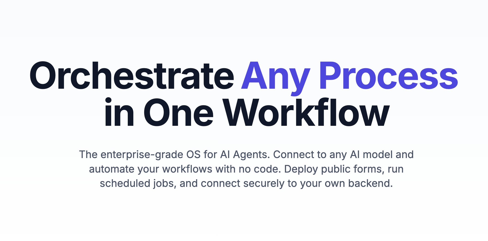
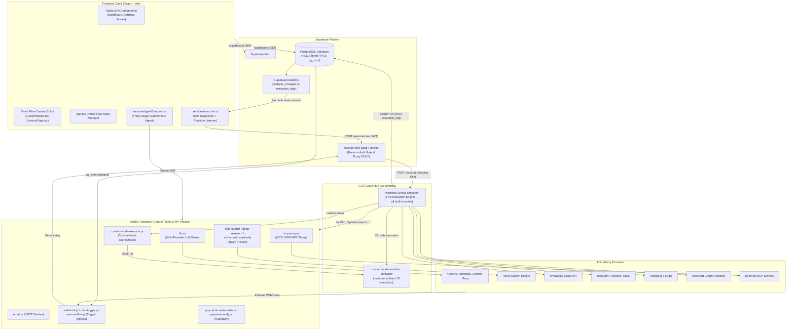

# Blupe

**A visual AI workflow automation platform — built from scratch as a learning project, now open source.**

Drag nodes onto a canvas, wire them together, and run real automations: LLM calls, autonomous agents, webhooks, schedules, email, Slack, WhatsApp, Telegram, Discord, Stripe, HubSpot, payments, human-in-the-loop approvals, custom JavaScript nodes, and MCP servers — with run history, versioning, a credit system, and an admin console on top.



---

## The story

It all started back in December, when Google announced that AI Studio was upgraded. Intrigued by the new capabilities, I wanted to see what it could actually build. I've always been passionate about the automation space, so I set a fun challenge: *could we create a canvas where a user can connect different blocks (nodes) to wire together custom workflows?*

I started by building the canvas UI and added two or three quick Node-ES nodes to it. But the next logical question was: *could it actually run, and could it generate a meaningful output?* Within the first two or three hours, I quickly hit the limits of what the AI workspace could generate on its own at that time. So, I exported the code and moved into customized, hands-on development—definitely with the help of AI as my pair programmer. By that night, the first version was live: a simple landing page, a functional canvas, and a few basic nodes.

From there, every day was a new learning curve. The interesting challenge wasn't just building integrations—which are fairly straightforward APIs—but understanding the "why" behind the core platform features:
- **Run History**: If a workflow goes wrong, we need to trace exactly what failed. If it succeeds, we want to see the exact payloads and responses.
- **Credit & Billing System**: A platform like this consumes real cloud and API resources, meaning it can't run for free. I had to build a server-side credit metering system that charges per node and resource consumed rather than a flat run fee.
- **Durable Snapshots & Versioning**: While not always needed, having a safety net to rollback changes is critical. I chose to embed version snapshot history directly inside the flow content JSONB to keep operations fast.
- **Relational Databases & RLS**: This was the first time I seriously designed a database schema and managed Row-Level Security (RLS) policies. Ensuring that many distinct tables—credits, webhooks, secrets, and runs—interact seamlessly and securely without blocking each other was my single biggest engineering learning.

Initially, executions took place purely on the client side in the browser. But that was never going to scale or remain secure. At the same time, I knew Blupe couldn't compete head-to-head on pure connector count with giants like Zapier or n8n. Instead of building hundreds of custom integrations, I focused on extensibility:
- **Webhooks**: Built robust inbound and outbound webhook tunnels to let Blupe hook into any external system.
- **Zapier Connector**: Added a Zapier node so you can trigger Zapier flows directly from Blupe workflows.
- **Agent Node**: Added a self-sustaining agent node running a ReAct (Reasoning and Action) loop. You provide an objective, and it autonomously selects the appropriate tools and nodes to get it done.
- **AI Flow Generator**: Integrated a prompt-based canvas onboarding wizard where users describe their automation goal, and the platform generates the entire node graph.
- **Bring Your Own Key (BYOK)**: To prioritize data privacy and reduce costs, users can bring their own API keys for Gemini, OpenAI, or Anthropic.

To make the platform scalable, secure, and production-ready, I moved execution from the browser to a backend hosted on **GCP Cloud Run** (which runs the workflow execution engine and runs user JS scripts inside an isolated container sandbox). I integrated email/password and Google Auth, built a billing checkout with Razorpay, and set up a comprehensive Admin Panel to track system usage, manage subscription tiers, add credits, and seed templates. 

Finally, I ran Blupe past a few users, gathered their feedback, and polished the UX. By the end of this project, I spent roughly **130 hours over seven or eight months** (working on it when I had time). Some people asked me why I bothered building this from scratch instead of using an existing tool. The answer is simple: it helped me learn. The biggest takeaway for me is that automation only looks seamless because of the massive engineering effort behind it—managing state, retries, logs, sandboxing, and security.

This codebase is now open to anyone to use, modify, and learn from. If you build something with it, I'd appreciate it if you credited this repository!

---

## What's inside

| Area | What you get |
|---|---|
| **Canvas** | React Flow editor with custom nodes/edges, property panel, notes, minimap |
| **Triggers** | Manual, form, webhook (per-flow API key), schedule (pg_cron), Telegram / WhatsApp / Discord / Razorpay inbound webhooks |
| **AI nodes** | Unified LLM node (Gemini, OpenAI, Anthropic, Groq, Ollama), Vision, Reasoning, autonomous Agent (ReAct), Batch, Deep Research / Web Search / URL Extract / Site Crawl (Tavily), Sarvam AI |
| **Logic & data** | Condition, Router, JavaScript, Wait, Human Approval (HITL), JSON / Math / Text utilities |
| **Integrations** | API call, RSS, Email (SMTP), Slack, Google Sheets, HubSpot, Stripe, Zapier, WhatsApp, Telegram, Discord, Razorpay, MCP (Model Context Protocol) servers |
| **Platform** | Run history & execution logs, flow versioning, public/shareable flows, embeddable forms, template gallery, AI flow generator, secrets vault (envelope encryption), BYOK |
| **Business** | Credit metering per node, subscription tiers, Razorpay payments, admin console (users, credits, nodes, templates, analytics) |
| **Execution** | Client-side canvas runs for development, plus a unified server-side engine on GCP Cloud Run for webhooks, schedules, and background runs; custom JS runs in an isolated Cloud Run sandbox |

## High-Level System Architecture

Blupe operates on a modern, secure, and decoupled topology:
- **Frontend Client (React + Vite + React Flow)**: A responsive single-page application hosted on Netlify that manages flow editing, node canvas state, and listens to live run progress.
- **Control Plane & Proxies (Netlify Functions)**: Serverless endpoints executing OAuth handshakes, Razorpay payment verification, and secure proxies for LLMs, Tavily search, and SMTP email.
- **Database & Realtime (Supabase)**: PostgreSQL database with Row-Level Security (RLS), stored procedures (RPCs) for atomic billing, Deno edge-function proxies (`execute-flow`), and Supabase Realtime for streaming live logs.
- **Secure Runtime (GCP Cloud Run)**:
  - `workflow-runner`: A high-concurrency Node.js engine executing standard flows, managing schedules, and logging runs.
  - `custom-node-sandbox`: A locked-down `node:vm` sandbox for executing user-authored JavaScript securely.



Deep dives live in [Architecture.md](Architecture.md) (execution lifecycles, schema catalog, agent loop, security model) and [DEVELOPMENT.md](DEVELOPMENT.md) (implementation history and details).

---

## Setting it up from scratch

### Prerequisites

- Node.js 20+
- A [Supabase](https://supabase.com) project (free tier works)
- [Netlify CLI](https://docs.netlify.com/cli/get-started/) (`npm i -g netlify-cli`) for local function routing
- Optional: a GCP account for the Cloud Run services, Razorpay account for payments, SMTP credentials for email, Tavily key for research nodes

### 1. Clone and install

```bash
git clone <your-fork-url>
cd blupe
npm install
```

### 2. Create the database

Open the **Supabase SQL Editor** and run the files in [`sql/`](sql/) in this order:

**Core schema (required)**

| Order | File | Creates |
|---|---|---|
| 1 | `sql/db_schema_update.sql` | `user_credits`, `flows`, `run_history`, `user_secrets` + RLS |
| 2 | `sql/fix_trigger_permissions.sql` | signup trigger that provisions credits for new users |
| 3 | `sql/fix_existing_users.sql` | backfills `user_credits` for any pre-existing users |

**Admin console & billing (required for the app to function fully)**

| Order | File | Purpose |
|---|---|---|
| 4 | `sql/db_admin_migration.sql` | `admin_nodes`, `admin_templates`, `admin_analytics_events`, admin flag |
| 5 | `sql/db_admin_fix.sql` then `sql/db_admin_fix_v2.sql` | admin RPC/policy fixes (run both, in order) |
| 6 | `sql/db_credit_cost_migration.sql` | per-node credit costs |
| 7 | `sql/db_subscription_migration.sql` | subscription expiry tracking |

**V2 features (webhooks, OAuth, templates, HITL)**

| Order | File | Purpose |
|---|---|---|
| 8 | `sql/db_v2_migration.sql` | `webhook_queue`, `webhook_rate_limits`, `oauth_connections`, `oauth_states`, `public_templates` |
| 9 | `sql/webhook_queue_setup.sql` | webhook queue processing helpers |
| 10 | `sql/flow_state_setup.sql` | `paused_executions` (human-in-the-loop) |
| 11 | `sql/fix_paused_executions_rls.sql` | RLS for client-side HITL runs |

**Server-side execution & scheduling**

| Order | File | Purpose |
|---|---|---|
| 12 | `sql/background_execution_setup.sql` | `schedule_queue`, `execution_logs` |
| 13 | `sql/db_serverside_scheduling.sql` | pg_cron + pg_net scheduled flow runs |
| 14 | `sql/db_execute_flow_realtime.sql` | realtime log streaming indexes |

**Performance, hygiene & security hardening**

| Order | File | Purpose |
|---|---|---|
| 15 | `sql/db_performance_indexes.sql` | query indexes |
| 16 | `sql/db_rate_limiting.sql` | public flow rate limiting |
| 17 | `sql/db_retention_cleanup.sql` | log/run retention jobs |
| 18 | `sql/db_security_remediation.sql` | `processed_payments`, endpoint request tracking, charge log |
| 19 | `sql/db_security_lockdown_v2.sql` | **run last** — RLS lockdown, wallet/admin forgery protection, hardened credit RPCs |

**Optional seeds & diagnostics**

- `sql/add_sarvam_nodes.sql`, `sql/add_ai_research_nodes.sql` — seed/clean optional AI nodes
- `sql/webhook_templates.sql` — starter webhook workflow templates
- `sql/diagnostic_queries.sql`, `sql/verify_new_signup.sql`, `sql/verify_user_record.sql` — sanity-check queries, not migrations

Finally, enable **Google** (and email/password) providers under Supabase → Authentication, and grant yourself admin:

```sql
UPDATE public.user_credits SET is_admin = true WHERE user_id = '<your-auth-user-uuid>';
```

### 3. Configure environment variables

Create a `.env` in the repo root (never commit it):

```bash
# Supabase (required)
SUPABASE_URL=https://<project-ref>.supabase.co
SUPABASE_ANON_KEY=<anon key>
SUPABASE_SERVICE_KEY=<service role key>          # server-side functions only
VITE_SUPABASE_URL=https://<project-ref>.supabase.co
VITE_SUPABASE_ANON_KEY=<anon key>

# Platform AI keys (any subset — users can also BYOK in-app)
GEMINI_API_KEY=
OPENAI_API_KEY=
ANTHROPIC_API_KEY=
GROQ_API_KEY=
TAVILY_API_KEY=                                   # web search / deep research nodes

# Secrets vault + cron (required for production)
SECRETS_MASTER_KEY=<32+ char random string>       # envelope encryption for user secrets
CRON_SECRET=<random string>                       # protects the scheduled-runner endpoint

# Email node (optional)
SMTP_HOST=
SMTP_PORT=587
SMTP_USER=
SMTP_PASS=
SMTP_FROM=

# Payments (optional — Razorpay)
RAZORPAY_KEY_ID=
RAZORPAY_KEY_SECRET=
RAZORPAY_KEY_ID_TEST=
RAZORPAY_KEY_SECRET_TEST=

# Cloud Run services (optional — see step 5)
CLOUD_RUN_CUSTOM_NODE_URL=
BLUPE_CUSTOM_NODE_SECRET=
VITE_CLOUD_RUN_WORKFLOW_RUNNER_URL=
```

OAuth-based nodes (Google Sheets/Gmail, Slack, HubSpot, Stripe, Microsoft) each need their own `*_CLIENT_ID` / `*_CLIENT_SECRET` pair — the full walkthrough is in [docs/OAUTH_SETUP.md](docs/OAUTH_SETUP.md).

> **Note:** the CORS allowlist ([netlify/functions/utils/cors.js](netlify/functions/utils/cors.js)), OAuth return-URL allowlist ([netlify/functions/utils/returnUrl.js](netlify/functions/utils/returnUrl.js)), and sandbox host allowlist reference the original `blupe.space` domains. Point them at your own domain when you deploy.

### 4. Run locally

```bash
npm run dev:full     # Vite + Netlify Functions on http://localhost:8888
# or
npm run dev          # frontend only, http://localhost:3001
```

### 5. (Optional) Deploy the Cloud Run services

Server-side execution — webhooks, schedules, background runs, custom JS nodes — runs on two small Cloud Run services:

```bash
cd cloudrun/custom-node-sandbox && ./deploy.sh    # isolated JS sandbox
cd cloudrun/workflow-runner && ./deploy.sh        # workflow execution engine
```

The scripts prompt for your GCP project, build with Cloud Build, and print the env vars to copy back into `.env` / Netlify. Without these services, the app still works for canvas (in-browser) runs.

### 6. Deploy the frontend

Push to a Netlify-connected repo (build command `npm run build`, publish `dist/` — already configured in [netlify.toml](netlify.toml)) and set the same env vars in Netlify's dashboard. Deploy the Supabase Edge Function with `supabase functions deploy execute-flow`.

### Verify a build

```bash
npm run build
npx tsc --noEmit
```

---

## What I learned (the short version)

1. **Reliability is the product.** A node that runs is a demo; a node that runs with retries, logs, metering, and a paper trail is a platform. Most of the 130 hours went into the invisible parts.
2. **Databases are a discipline, not a detail.** RLS policies, `SECURITY DEFINER` functions, triggers that provision users, tables that don't lock each other up — owning this end-to-end taught me more than any tutorial.
3. **Position around what you can't do.** I couldn't out-integrate Zapier, so webhooks-in/webhooks-out became the strategy — including a node that drives Zapier itself.
4. **Client-side execution doesn't scale — or bill honestly.** Moving execution to Cloud Run was as much about trustworthy metering and security as it was about performance.
5. **Security is a process.** JWT verification on every endpoint, envelope-encrypted secrets, SSRF guards in the sandbox, server-side credit deduction, RLS lockdowns — each closed a hole I only understood by finding it. I won't claim tier-1 security, but every layer here was earned.
6. **Ship it past real users.** A handful of testers found friction I'd been blind to for months.

## Contributing & credit

This is a learning project shared in that spirit. Issues and PRs are welcome, but expect a codebase that grew organically. If you use it — as a product base, a reference, or a teardown — **please credit the original author: Aravind ([aravind.me](https://aravind.me))**. That's all I ask.

## Disclaimer

This platform was built as a serious learning exercise, not a hardened commercial product. Review the security notes, run the lockdown SQL, rotate every key, and do your own audit before putting real users or money on it.
